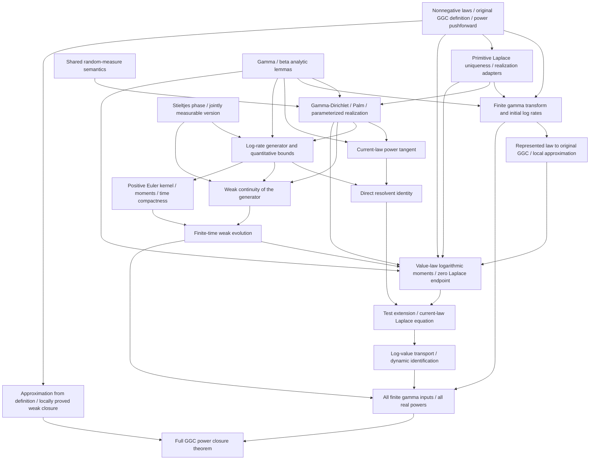

# Lean Blueprint for GGC Power Closure

The deliverable is a Lean proof of the main theorem: **every nonnegative GGC probability law remains GGC under every finite real power \(q\ge1\)**. Toolchain setup, definitions, and tangent identities are intermediate deliverables, not substitutes for that theorem.

**User scope correction, 2026-09-24: M0–M7 are accepted as `verified`
within the registered trust boundary.** The distribution version is the complete
mathematical deliverable. The user withdraws the random-variable corollary
requirement: RV-1 is withdrawn by scope decision, not implemented.

E1's readability migration is implemented with root `Definitions.lean` and
an explicit four-step proof in `main.lean`; **E1 is accepted as `verified`**.
The independent clean build passed 3940 jobs with 137/137 project modules
freshly compiled; the subsequent direct audit matched all 883 checks. See
[Section 14](#e1-design-acceptance-2026-09-24).
The root location and English-only Lean comments follow the current project
conventions recorded in the E1 construction report and README. Section 4.1
records the actual ownership. The mathematical scope and RV-1 withdrawal remain unchanged.

The earlier M7 independent clean project build passed **3939 jobs**, freshly compiling
all **136 project Lean modules**. The subsequent direct audit matched all
**883 axiom checks** and found only the registered whitelist. Dependency
caches were retained. [lean-toolchain](lean-toolchain) still pins Lean
**4.32.2** and [lakefile.toml](lakefile.toml) pins mathlib
**`905b95818eb32af7874a58b427f50c1711a5e96c`**.

[Definitions.lean](Definitions.lean) retains the complete original weak-limit
definition and target; [main.lean](main.lean) supplies the readable final proof.
[GGC/PowerClosure.lean](GGC/PowerClosure.lean) retains the finite-input details.
Thorin representability remains separate. E-B1 and E-B3 are now locally proved
theorems. The unused E-B2 axiom and its forward/equivalence characterization
interfaces have been removed; the undeclared E-B4 fallback is withdrawn. The final law theorem uses exactly E-J1–3, E-T1 and
E-S1, plus `propext`, `Classical.choice`, and `Quot.sound`. These five literature
statements remain assumptions; E-B2 is absent from the final dependency set.

**E2 is independently accepted as `verified`.** E-B3 finite-atomic approximation
and E-B1 Thorin realization preserve their original complete primitive types
and use standard logic only. The independent clean build passed **3950 jobs**,
freshly compiling **147/147 project modules**; the subsequent direct audit
matched **957/957 checks**. That E2 snapshot had six project axioms; the later
E2-P cleanup leaves five, all used by the main theorem. See the
[construction contract](#e2-bondesson-formalization) and
[independent acceptance](#e2-design-acceptance-2026-09-24).

**S1-SOURCE is closed by independent source review.** The actual 2010
first-edition pages and errata were inspected against the E-S1 interface;
the historical [semantic audit](SemanticAudit-2026-09-24.md) remains unchanged.
The [designer response](#semantic-audit-followup) records the closure.
This source review does not remove E-S1's axiom status.

Sections 8–13 preserve earlier acceptance and design snapshots; Section 14
records E1 acceptance; Section 17 records the E2/source-review snapshot.
[Section 18](#unused-axiom-cleanup) records the subsequent E-B2 removal and
[Section 19](#e3-james-reduction-plan) proposes the next reduction round.
RV-1 remains withdrawn. The [reuse gate](#module-reuse-gate) continues to apply, and
the jointly maintained [MathlibAPI.md](MathlibAPI.md) records accepted uses
and the entry-point migration evidence.

General rules and trust boundaries are in the [README](README.md); external inputs use its [single whitelist](README.md#external-inputs). This blueprint specifies dependencies, mathematical contracts, construction order, and acceptance criteria. The mathematical index is [WIP](../WIP.md); the main assembly and audit are [WIP-6.21](../ledger/23-power-theorem-assembly-audit.md#wip-6-21) and [WIP-6.23](../ledger/25-mathematical-completion-audit.md#wip-6-23).

## 1. Final theorem and required scope

For a real-valued probability law \(\mu\) concentrated on \([0,\infty)\), and \(q\in\mathbb R\) with \(1\le q\), prove

\[
\operatorname{IsGGC}(\mu)
\quad\Longrightarrow\quad
\operatorname{IsGGC}\bigl((x\mapsto x^q)_*\mu\bigr).
\]

The declaration `GGC.GGCPowerClosure : Prop` in [Definitions.lean](Definitions.lean) has this quantifier structure and unfolds Section 2.1's original weak-limit definition. Its proof is `GGC.ggc_rpow` in [main.lean](main.lean). The substantive hypotheses are only nonnegativity of the probability law, GGC membership, and \(q\ge1\); the registered literature dependencies remain explicit in the audit. Its scope includes:

- Every finite real exponent, including noninteger powers and \(q=1\), rather than only squares or a local interval of exponents.
- Arbitrary drift \(a\ge0\), infinite total Thorin mass, and nonatomic Thorin measures.
- All nonnegative degenerate laws, including \(\delta_0\) and \(\delta_a\). Random-variable values are finite real numbers; \(+\infty\) is not an additional value.
- No final assumptions of finite moments, finite logarithmic moments, finite Thorin mass, finite support, or zero drift.

First prove power closure for finite gamma convolutions. Then, for each fixed \(q\), use weak approximation and GGC weak closure. The second log-rate moments and construction constants may depend on each finite input and on \(T=\log q\). They need not be uniform over the approximating sequence. An evolution on an infinite time interval is not required.

## 2. Objects and interface conventions

Use a **law-first, supported-real** model. The implemented `GGC.NonnegLaw` in [Definitions.lean](Definitions.lean) wraps `MeasureTheory.ProbabilityMeasure ℝ` together with an a.e. nonnegativity proof for its underlying measure. That file owns all project-specific definitions required to read the main statement. The distribution theorem is the complete required result; no random-variable corollary is required. Choosing a common probability space, independent copies, or a path process must not become additional main-theorem hypotheses.

| Object | Current representation or remaining contract |
|---|---|
| Nonnegative value law \(\mu\) | `NonnegLaw` and `powerLaw μ q hq` are implemented in `Definitions.lean`, where `hq : 0 ≤ q`. The definition uses the actual map \(x\mapsto x^q\), its continuity for nonnegative exponents, and a proof of nonnegative concentration. `powerLaw_toMeasure` exposes this semantics; `powerLaw_one` and `isGGC_powerLaw_one` supply the exponent-one sanity check. `GGC/Basic.lean` now proves fixed-power preservation of weak convergence as `power_pushforward_tendsto`. |
| Positive rate \(b\) | `PosReal := {b : ℝ // 0 < b}` is implemented in `Definitions.lean`. Rate space and value space are distinct. Log rates live in \(\mathbb R\); `RateRealization` supplies the measurable `exp`/`log` equivalence and pushforward adapters. |
| Thorin data | `ThorinAdmissible` and `ThorinData` live in `GGC/Thorin/Basic.lean`, re-exported by `GGC/Thorin.lean`. They contain nonnegative drift \(a\), a positive rate measure \(U\), and `Integrable` for \(\log(1+1/b)\), without finite total mass. `ThorinAdmissible.integrable_log` proves integrability for every \(s\ge0\); `thorinAdmissible_iff_endpoint` proves the endpoint equivalence, explicitly including local finiteness. These data describe the analytic characterization, not the original GGC definition. |
| GGC membership | Implemented: `IsGGC μ` means that \(\mu\) is a weak limit of actual finite gamma convolutions, as specified in Section 2.1. It has no Thorin-representation premise. |
| Thorin representability | `HasThorinRepresentation` remains separate from `IsGGC`. `HasThorinRepresentation.isGGC` proves the direction required by the main theorem, using locally proved E-B3. The unused converse and equivalence were retired with E-B2. `existsUnique_law_thorinLaplace` combines the locally proved E-B1 with local Laplace uniqueness, using standard logic only. |
| Finite gamma law | `gammaLaw`, `finiteGammaLaw`, and `IsFiniteGammaConvolution` use actual gamma measures and a finite product/sum pushforward in `Definitions.lean`. `ProbabilityMeasure.pi` has underlying measure `Measure.pi`. No transform formula defines this class. `laplace_finiteGammaLaw` proves its exponential finite-sum transform for every \(s\ge0\); `finiteThorinMeasure`, `finiteThorinData` and `hasThorinRepresentation_finiteGammaLaw` supply the adapter \(U=\sum_i\alpha_i\delta_{b_i}\). The empty product/sum gives \(\delta_0\). `Identification.exists_finiteGamma_initialData` supplies normalized log-rate data and the nonempty mass/second-moment certificates. |
| Log-rate state \(F\) | `ProbabilityMeasure ℝ`, with an additional finite-second-moment hypothesis where needed. Set \(U=B\exp_*F\). Define coefficients for every probability \(F\), before proving Thorin admissibility, so the Euler iteration is not circular. |
| Evolution \(F_t\) | `LogRate.WeakLogRateSolution` packages a narrowly continuous probability curve, its initial state, a uniform second-moment bound and the integral weak equation for the specified generator on \([0,T]\). `LogRate.exists_weakLogRateSolution` constructs an inhabitant from the actual Euler curves for every \(T>0\); it does not assume an existence axiom. |
| Value and log-value laws | \(\mu_t\) is the zero-drift GGC law associated with \(U_t\); \(\lambda_t=(\log)_*\mu_t\). Prove \(\mu_t((0,\infty))=1\) before taking log values. \(F_t\) describes log **rates**, whereas \(\lambda_t\) describes log **values**. |
| Test functions | Specify predicates or structures for \(C_c^2(\mathbb R)\), linearly growing \(C^2\) functions with bounded first and second derivatives, and \(C_c^1((0,\infty))\). Moving between test domains requires an extension lemma. |

The initial files now select concrete imports and APIs in the pinned revision. Follow the README for their actual validation status. Further APIs for weak convergence, probability kernels, differentiation, and parameterized random measures must still be inspected and tested. Failure to find an API does not authorize narrowing these mathematical contracts.

<a id="original-ggc-definition"></a>

### 2.1 Original definition and the represented-law adapter

For \(k\in\mathbb N\) and shapes/rates \(\alpha_i,b_i>0\), define the finite gamma law by
\[
\operatorname{finiteGammaLaw}(k,\alpha,b)
 =\left(x\mapsto\sum_{i\in\mathrm{Fin}(k)}x_i\right)_*
   \bigotimes_{i\in\mathrm{Fin}(k)}\operatorname{Gamma}(\alpha_i,b_i).
\]
The product measure encodes independence. A law is `IsFiniteGammaConvolution` exactly when it equals such a pushforward. Shapes and rates may vary with every approximant, \(k=0\) is permitted, and no boundedness or uniform moment condition is added. The actual gamma law uses the shape/rate density already represented by mathlib's `ProbabilityTheory.gammaMeasure`; give the complete project wrappers in `Definitions.lean` and prove their normalization and nonnegative concentration.

The public definition is
\[
\operatorname{IsGGC}(\mu)\;:\!\Longleftrightarrow\;
\exists(\mu_n)_{n\in\mathbb N},\quad
 (\forall n,\ \operatorname{IsFiniteGammaConvolution}(\mu_n))
 \ \land\ \mu_n\Rightarrow\mu.
\]
Use a sequence of `NonnegLaw` objects and `Tendsto` of their underlying `ProbabilityMeasure ℝ` values to `μ.law` in the weak topology. This statement does not quantify over a shared sample space or over Thorin data. If topology-based closure is used internally, prove its equivalence with this sequential definition. In particular, prove weak closure of this class locally by the sequential/closure bridge or a metric diagonal argument; it does not follow merely by unfolding one existential sequence.

Keep the analytic predicate separate:
\[
\operatorname{HasThorinRepresentation}(\mu)\;:\!\Longleftrightarrow\;
\exists a\ge0,\ U\ge0,\quad
 \int\log(1+1/b)\,U(db)<\infty,
\quad\forall s>0,\quad
 L_\mu(s)=\exp\{-as-\int\log(1+s/b)\,U(db)\}.
\]
`GGC/Thorin.lean` exposes `HasThorinRepresentation.isGGC` for every
`NonnegLaw`. This locally proved direction covers zero and constant laws,
nonzero drift, nonatomic measures and infinite Thorin mass. It is sufficient
to certify the value laws constructed in the power-closure proof. It is never
the definition of `IsGGC` or an extra hypothesis of `ggc_rpow`.

**User scope correction after E2:** the converse
`IsGGC.hasThorinRepresentation` and equivalence
`isGGC_iff_hasThorinRepresentation` had no production consumers. They are
removed together with the E-B2 axiom on which they depended. The former E-B4
fallback is withdrawn, not replaced by another axiom. A full characterization
may be added later with a local proof, but it is not a required deliverable.
This removes optional interfaces; it does not prove E-B2 or the converse.
The original finite-gamma weak-limit definition and final theorem are unchanged.

Arbitrary admissible Thorin data has a unique realizing law through locally
proved E-B1 and Laplace uniqueness. E-B3 supplies actual finite-gamma
approximation and the represented-law membership direction. Positive constant
laws therefore remain locally proved GGC members. Admissibility includes local
finiteness through a proved equivalence; no extra mass/moment assumption is
added to `IsGGC`.

**Semantic acceptance:** inspect the full definitions of `gammaLaw`,
`finiteGammaLaw`, `IsFiniteGammaConvolution`, `IsGGC` and
`HasThorinRepresentation`, together with the retained membership direction.
Check actual product-law independence, weak convergence, empty sums, single
Gamma laws and every nonnegative constant. The axiom-free original-GGC weak
closure remains in `GGC.WeakClosure`; it is not the removed E-B2 statement.

The dated M1/E2 records in Sections 11 and 17 preserve the former two-direction
characterization and its then-dependencies. Current scope is governed by this
section and Section 18. Source provenance remains Bondesson (1992), Section
3.1, pp.29 and 34-35, as recorded in the
[primary-interface audit](../notes/log-rate-power-proof-primary-interfaces.md).

## 3. Main dependency graph

Use the **direct log-generator resolvent verification** of [WIP-6.22](../ledger/24-direct-log-generator-resolvent.md#wip-6-22). This removes a dependency on the intermediate rate-coordinate operator. The general rate operator, conditional mass formula, and local continuation route in WIP-6.12--6.15 are optional extensions, not prerequisites for the first main-theorem implementation.



All core graph nodes now have Lean implementations, including B's initial log-rate data, V's constructed weak evolution, J's dynamic identification and Z's final law theorem. L's Laplace uniqueness and E-B1 realization are locally proved. H uses the locally proved E-B3 membership direction only. E-B2 and the unused characterization consumers are removed; E-B4 is withdrawn. W's original-definition weak closure and reduction use standard logical axioms only. `PowerClosure` discharges W's finite-input premise using the constructed evolution at \(T=\log q\). The graph describes mathematical contracts, not the exact Lean import graph; Section 4.2 maps the contracts to their actual modules. External sources supply only the foundational inputs individually listed in the README. The project generator, continuity, Euler limit, dynamic identification and final assembly are proved locally. The user has withdrawn the random-variable corollary requirement.

## 4. Implemented modules and source mapping

Paths are relative to `formalization/`. The Lake library is `GGCPower`, with roots `Definitions`, `main`, `GGC`, `External`, and `AxiomAudit`. Its globs explicitly include `Definitions`, `main`, `AxiomAudit`, and every `GGC` and `External` submodule. `Definitions.lean` owns definitions; `main.lean` is the readable theorem entry point. The current files are:

| Existing file | Current contents and limits |
|---|---|
| [lean-toolchain](lean-toolchain), [lakefile.toml](lakefile.toml) | Pinned Lean/mathlib and the Lake library configuration. The generated `.lake` directory is excluded by the repository ignore rules. |
| [Definitions.lean](Definitions.lean) | Complete original GGC definition, actual gamma/product/sum and power laws, and `GGCPowerClosure`. Imports mathlib only. |
| [main.lean](main.lean) | The unique `ggc_rpow`, with explicit approximation, finite-input closure, power-pushforward convergence and weak-closure steps and English mathematical comments. |
| [GGC/Basic.lean](GGC/Basic.lean) | Moved law/endpoint lemmas, the constant-law power identity, and fixed-power preservation of weak convergence. |
| [GGC/FiniteGamma.lean](GGC/FiniteGamma.lean) | Product/sum semantics, empty- and one-factor identities, finite-gamma and zero-law GGC membership via constant sequences. Scalar and finite-sum Laplace formulas are proved from the gamma density and product integration, including \(s=0\). The finite-atomic adapter is in `GGC.Thorin`; initial log rates are constructed in `GGC.Identification.InitialData`. |
| [GGC/Laplace.lean](GGC/Laplace.lean) | Laplace integrability, normalization, positivity, bounds and constant-law formula; `measure_eq_of_laplace_nat_eq` and `nonnegLaw_eq_of_laplace_eq` prove finite-measure/nonnegative-law uniqueness without extra moments or external mathematical axioms. |
| [GGC/Thorin/Basic.lean](GGC/Thorin/Basic.lean) | Independent Thorin data, separate representation predicate, parameter integrability, endpoint equivalence and finite-atomic certificates; moved definitions and proofs preserve their public names and semantics. |
| [GGC/LaplaceTightness.lean](GGC/LaplaceTightness.lean), [GGC/Thorin/Approximation.lean](GGC/Thorin/Approximation.lean), `GridMeasure`, `GridMeasureMap`, `FiniteWeights`, `Drift`, `Normalization`, `Sequence`, [Realization](GGC/Thorin/Realization.lean) | Independent finite-gamma approximation, drift absorption, lower-bound tightness and full E-B1/E-B3 core proofs. Section 15.3 records the accepted decomposition. No literature axiom is used. |
| [GGC/Thorin.lean](GGC/Thorin.lean) | Public facade for represented-law membership and realization adapters. All retained declarations use standard logic only; the unused converse and equivalence are removed. Varying-data regularity and derivatives remain in `Identification`. |
| [GGC/WeakClosure.lean](GGC/WeakClosure.lean) | `isGGC_iff_mem_closure` and `isGGC_of_tendsto` prove original-GGC weak closure through metrization and sequential closure, with no Thorin dependency. |
| [GGC/Reduction.lean](GGC/Reduction.lean) | `isGGC_powerLaw_of_finiteGamma` and `ggcPowerClosure_of_finiteGamma` prove the conditional reduction. `GGC.PowerClosure` now discharges its explicit finite-input premise. |
| [External/Bondesson.lean](External/Bondesson.lean) | E-B1 `thorin_realization` and E-B3 `finite_atomic_approximation`, with primitive measure/Laplace contracts and source annotations. Both are locally proved compatibility theorems. E-B2 is removed; this file declares no axiom. |
| [External/README.md](External/README.md), [External/James.lean](External/James.lean), [External/SSV.lean](External/SSV.lean), [External/Sethuraman.lean](External/Sethuraman.lean) | Seven active interfaces: two proved Bondesson endpoints and five remaining axioms. E-B2 survives only in historical source/acceptance records; E-B4 is withdrawn. SSV imports mathlib; James and Sethuraman additionally use independent shared random-measure semantics. Bondesson imports the independent Thorin proof layer for its theorem wrappers. |
| [GGC/PowerClosure.lean](GGC/PowerClosure.lean) | `isGGC_power_valueLaw`, `isGGC_power_finiteGammaLaw`, `isGGC_power_of_isFiniteGammaConvolution`; detailed finite-input assembly. The public `ggc_rpow` now lives in `main`. |
| [AxiomAudit.lean](AxiomAudit.lean) | Prints definitions and complete external contracts, checks the expanded final theorem type, and audits 954 declarations including `ggc_rpow`. The persistent audit also prints its actual proof body. |

<a id="statement-proof-separation"></a>

### 4.1 E1: definitions module and readable main theorem

**Implemented and independently accepted (`verified`).** The earlier recommendation
was `GGC/Definitions.lean`; the accepted implementation choice places
`Definitions.lean` in the formalization root. This preserves the intended
separation from `GGC/Basic.lean`. The declaration namespace remains `GGC`.
The construction report records the user's subsequent root-path override;
this section now reflects the actual root module and explicit Lake coverage.
Earlier acceptance records retain the paths used at their time.

| Target file | Ownership after E1 |
|---|---|
| `Definitions.lean` | Move all current definitions: `PosReal`, `NonnegLaw`, `gammaLaw`, `finiteGammaLaw`, `IsFiniteGammaConvolution`, `IsGGC`, `powerLaw`, `GGCPowerClosure`. Keep complete definitions, explanatory comments, and construction proof fields for normalization and nonnegativity. Import mathlib only, with no external or downstream proof dependencies. |
| `GGC/Basic.lean` and other helpers | Replace old definition-layer `import main` with `import Definitions` where needed. Existing elementary, analytic and Thorin lemmas keep their owners. None of the new main's dependencies may import `main`. |
| `GGC/PowerClosure.lean` | Retain `isGGC_power_valueLaw`, `isGGC_power_finiteGammaLaw`, `isGGC_power_of_isFiniteGammaConvolution` and detailed finite-input assembly using the existing evolution/identification modules. Move the public `ggc_rpow` out; do not duplicate it under a second name. |
| New `main.lean` | Import `Definitions` and proof modules, principally `GGC.PowerClosure` and `GGC.WeakClosure`. Own the unique `GGC.ggc_rpow : GGC.GGCPowerClosure`, with the visible mathematical steps below. No `main : IO Unit` is required. |
| `AxiomAudit.lean` | Import the new `main`; preserve definition and external-contract checks. Check the expanded main theorem type, print its proof body and transitive axioms from the new owner. |

The final proof must visibly carry out the following steps using existing
lemmas, rather than remaining a one-line application of the general reduction:

1. Introduce `μ`, real `q ≥ 1` and the GGC hypothesis. Unpack `IsGGC`
   to obtain finite-gamma laws `μs n` converging weakly to `μ`. Explain that
   their moments, shapes and rates need not have uniform bounds.
2. Prove each powered approximant is GGC using
   `isGGC_power_of_isFiniteGammaConvolution`. Explain its packaged argument:
   empty sums and `q = 1` are covered; for nonempty inputs and `q > 1`,
   normalized finite Thorin data gives an initial log-rate law, the evolution
   is constructed to `T = log q`, and dynamic identification gives the actual
   power law. These details stay in `PowerClosure` and its dependencies.
3. Use `power_pushforward_tendsto` to obtain weak convergence of the powered
   laws to `powerLaw μ q …`. Explain why continuity of the fixed power map
   applies and why the limit is the actual probability law.
4. Use `isGGC_of_tendsto` to conclude. Explain that the limit step removes
   the intermediate finite-mass and log-rate-moment restrictions.

Use named intermediate membership and convergence facts. The file overview
should link the definitions and detailed modules; the theorem docstring
should state the full law scope and its current five literature dependencies
(seven at the E1 acceptance snapshot; reduced by the accepted E2 proofs).
Comments should explain mathematical purpose and hypotheses, not merely
repeat tactics. All project Lean comments and docstrings are written in English,
following the current README convention; retain Lean names and mathematical notation.
Do not move lengthy analysis or duplicate generic proofs into `main`.

The intended dependency direction is:

```text
mathlib → Definitions → GGC helpers → GGC.PowerClosure → main → AxiomAudit
mathlib → shared random-measure semantics → External → GGC proof modules
```

Arrows point from dependency to consumer. External files keep their independent
shared semantics. After migration, `import main` exposes the final theorem;
`import GGC.PowerClosure` exposes its supporting lemmas, not `ggc_rpow`.
Do not add a compatibility back-import that would create a cycle.

**Acceptance:** preserve definition semantics, names and the full theorem type;
inspect the real proof steps and comments; replace every old definition-layer
`import main`; update audit imports, module docstrings, README layout and API
consumers. Verify `Definitions` is explicitly included in Lake roots and globs,
and that the default build includes `main`, all proof modules and the audit. Require an acyclic import
graph, a clean project build followed by a direct audit, and preservation of
the trust boundary for a pure migration. E1 preserved seven literature axioms
plus standard logic; the separately accepted E2 proofs now reduce this to five.
Record fresh module/check counts; old counts do not verify the migration.
The accepted M7 mathematics remains closed; E1 has separate migration evidence.

### 4.2 Proof contracts and actual implementation

The first table preserves the original contract decomposition and manuscript locators. Its proposed filenames and theorem names are not all literal current APIs: construction split several contracts into smaller modules. The implementation map following it gives the actual consumers. Local adapters belong with the relevant mathematics and import `Definitions` as needed; the public final theorem belongs to `main.lean`.

| Proposed file | Proposed declarations or deliverable | Written proof and manuscript locator |
|---|---|---|
| `GGC/Basic.lean` | The existing basic declarations listed in Section 4.1, followed by `power_pushforward_weaklyContinuous` and its `NonnegLaw`/`powerLaw` adapter; imports `Definitions` | [Definitions.lean](Definitions.lean), existing helper proofs; [WIP-0.1](../ledger/00-foundations.md#wip-0-1); [completion section](../manuscript/sections/06-completion.tex) |
| `GGC/Laplace.lean` | `laplace`, `nonnegLaw_eq_of_laplace_eq`, Laplace normalization/positivity/integrability; primitive probability-measure statements with no moment assumptions. Realization adapters using Thorin data belong to `GGC.Thorin`, avoiding a reverse import | [foundations](../manuscript/sections/01-foundations.tex), `lem:gamma-dirichlet`; [identification](../manuscript/sections/05-identification.tex), transform-uniqueness argument following `eq:id-positive-log`; E-B1 local obligations |
| `GGC/FiniteGamma.lean` | Product/sum semantics lemmas, scalar and finite-sum Laplace formulas, finite-gamma membership and zero-law membership via constant sequences; imports `GGC.Basic` and `GGC.Laplace`, not `GGC.Thorin` | Section 2.1; [foundations ledger](../ledger/00-foundations.md) |
| `GGC/WeakClosure.lean` | Sequential/closure equivalence or metric diagonal construction, then `isGGC_of_tendsto`; consumes the original definition and `GGC.Basic`, with no Thorin-characterization dependency | Section 2.1; [preliminaries](../manuscript/sections/01-foundations.tex), `lem:ggc-closure` |
| `GGC/Thorin.lean` | Thorin data and `HasThorinRepresentation`, integrability and derivative lemmas, realization adapters, `HasThorinRepresentation.isGGC`, `hasThorinRepresentation_diracLaw`, and revised `isGGC_diracLaw`; imports finite-gamma/Laplace results and only the external contracts actually used | Section 2.1; [foundations ledger](../ledger/00-foundations.md); [preliminaries](../manuscript/sections/01-foundations.tex), `eq:thorin-representation` |
| `GGC/Reduction.lean` | Conditional finite-gamma-to-general reduction; consumes `GGC.Basic`, `GGC.WeakClosure`, and approximation from the original definition; no final theorem assumed or claimed | [WIP-6.21](../ledger/23-power-theorem-assembly-audit.md#wip-6-21); [completion section](../manuscript/sections/06-completion.tex) |
| `GGC/Foundations/RandomMeasure.lean` | Actual random-measure evaluation, finite-partition Dirichlet semantics including zero-mass cells, and required measurable structures; no project conclusions or external axioms | [foundations](../manuscript/sections/01-foundations.tex), Dirichlet-process convention; [measurable realizations](../manuscript/sections/07-measurable-realizations.tex); E-J1--E-J3 and E-T1 prerequisites |
| `GGC/GammaAnalysis.lean` | Gamma/beta density conventions, digamma semantics, gamma and beta logarithmic integrals, and uniform bounds on compact positive mass intervals; reuse mathlib and prove missing analytic adapters locally | [tangent](../manuscript/sections/02-power-tangent.tex), proof of `lem:tangent`; [generator](../manuscript/sections/03-log-generator.tex), proof of `lem:bounds`; [identification](../manuscript/sections/05-identification.tex), `eq:id-log-moment` |
| `GGC/GammaDirichlet.lean` | `dirichletMean_laplace`, `tiltedLaw_eq_gammaDirichlet`, `posterior_palm`, `parameterized_dirichlet`, and the locally proved Dirichlet pushforward adapters connecting log-rate and positive-rate bases | [WIP-6.11](../ledger/19-finite-thorin-compensated-power-tangent.md#wip-6-11), [WIP-6.16](../ledger/20-finite-thorin-positive-steps.md#wip-6-16); [measurable realizations appendix](../manuscript/sections/07-measurable-realizations.tex), `lem:parameterized-dirichlet` |
| `GGC/StieltjesPhase.lean` | `phase_jointlyMeasurable`, `phase_anchor_one`, `phase_unique_ae`, `phase_integrals_tendsto` | [WIP-6.11](../ledger/19-finite-thorin-compensated-power-tangent.md#wip-6-11), [WIP-6.18](../ledger/21-log-thorin-euler-evolution.md#wip-6-18); [preliminaries](../manuscript/sections/01-foundations.tex), `lem:phase` |
| `GGC/PowerTangent.lean` | `currentLaw_power_tangent`, `normalized_power_tangent`, `power_tangent_eq_deriv_s_mul_tilted_logMoment` | [WIP-6.11](../ledger/19-finite-thorin-compensated-power-tangent.md#wip-6-11); [tangent section](../manuscript/sections/02-power-tangent.tex), `lem:tangent`; [identification](../manuscript/sections/05-identification.tex), `eq:id-current-tangent` |
| `GGC/LogRate/Generator.lean` | `jumpMeasure`, `correctionKernel`, `logDrift`, `acceptance`, `logGenerator`; joint measurability | [WIP-6.16](../ledger/20-finite-thorin-positive-steps.md#wip-6-16); [generator section](../manuscript/sections/03-log-generator.tex), `eq:generator` |
| `GGC/LogRate/Bounds.lean` | `correctionKernel_integrable`, `jump_secondMoment_finite`, `drift_linear_bound`, quadratic Lyapunov bound | [WIP-6.17](../ledger/20-finite-thorin-positive-steps.md#wip-6-17); [generator section](../manuscript/sections/03-log-generator.tex), `lem:bounds` |
| `GGC/LogRate/Resolvent.lean` | `direct_resolvent_cancellation`, `averaged_generator_resolvent` | [WIP-6.22](../ledger/24-direct-log-generator-resolvent.md#wip-6-22); [generator section](../manuscript/sections/03-log-generator.tex), `lem:generator` |
| `GGC/LogRate/Continuity.lean` | `averaged_generator_continuous`, uniform boundedness for compact tests over all states and masses in a compact positive interval | [WIP-6.18](../ledger/21-log-thorin-euler-evolution.md#wip-6-18); [evolution section](../manuscript/sections/04-evolution.tex), `lem:continuity` |
| `GGC/LogRate/Euler.lean` | `positiveEulerKernel`, exact one-step moments, uniform second moments, time modulus, cumulative consistency error | [WIP-6.19](../ledger/21-log-thorin-euler-evolution.md#wip-6-19); [evolution section](../manuscript/sections/04-evolution.tex), `eq:positive-euler-kernel` through `eq:euler-total-error` |
| `GGC/LogRate/Existence.lean` | `exists_weakLogRateSolution` | [WIP-6.19](../ledger/21-log-thorin-euler-evolution.md#wip-6-19); [evolution section](../manuscript/sections/04-evolution.tex), `thm:evolution` |
| `GGC/Identification/Moments.lean` | `valueLaw_logMoment_bound`, strict positivity, narrow continuity of value laws, Thorin admissibility | [WIP-6.20, Sections 1--2](../ledger/22-power-flow-identification.md#wip-6-20); [identification section](../manuscript/sections/05-identification.tex), `eq:id-log-moment` |
| `GGC/Identification/WeakEquation.lean` | Test-domain extension, `tangent_spaceTime_integrable`, `zero_endpoint_bound`, `laplace_weak_equation`, `value_weak_equation` | [WIP-6.20, Sections 3--7](../ledger/22-power-flow-identification.md#wip-6-20); [identification section](../manuscript/sections/05-identification.tex), `eq:id-absolute-fubini`, `eq:id-value-weak` |
| `GGC/Identification/Transport.lean` | `log_value_transport_unique`, `identify_power_flow` | [WIP-6.20, Section 8](../ledger/22-power-flow-identification.md#wip-6-20); [identification section](../manuscript/sections/05-identification.tex), `thm:identification` |
| `GGC/PowerClosure.lean` | Finite-input closure and detailed assembly; E1 has moved the public `ggc_rpow : GGCPowerClosure` to `main.lean`. No random-variable corollary is required | [WIP-6.21](../ledger/23-power-theorem-assembly-audit.md#wip-6-21); [completion section](../manuscript/sections/06-completion.tex); [full-scope audit](../ledger/25-mathematical-completion-audit.md#wip-6-23) |

| Contract / stage | Actual implementation and principal endpoint |
|---|---|
| M2 analysis, Dirichlet and posterior laws | `GammaAnalysis`, `BetaAnalysis`, `GammaDirichlet`, `GammaDirichletTangent`, `Palm`, `RateRealization`, `DirichletRealization`; `Foundations/Quantile` and `QuantileContinuity` supply the ordered real sampler. |
| M2 phase and power calculus | `StieltjesPhase`, `PowerTangent` and their analytic foundations: canonical measurable phase and the differentiated actual power-law Laplace transform. |
| M3 generator and resolvent | `LogRate/Generator`, `CanonicalBounds`, `GeneratorResolvent`; endpoint `integral_generator_eq_normalized_powerTangent` uses the actual `(B,F)` generator. |
| M4 weak continuity | `PhaseWeakContinuity`, `DirichletContinuity`, `LogRate/GeneratorContinuity`, `LogRate/Continuity`: L¹ phase pairing, common-space posterior coupling and varying-law generator integration. |
| M5 finite-time evolution | `LogRate/Euler`, `EulerMoments`, `EulerTightness`, `EulerInterpolation`, `EulerLimitCurve`, `EulerWeakEquation`, `Existence`; endpoint `exists_weakLogRateSolution`. |
| M6 moments and time equations | `Identification/ValueLaw`, `Moments`, `LogValueContinuity`, `TangentSpaceTime`, `TestExtension`, `LaplaceEvolution`, `LogTransport` and their supporting modules. |
| M6 identification | `Identification/TransportUniqueness`, `DynamicIdentification`; endpoint `valueAt_eq_powerLaw`, followed by `isGGC_power_valueLaw_of_weakSolution`. |
| M7 assembly | `Identification/InitialData` and `PowerClosure`; actual finite-gamma law is matched to its initial value law, and `ggc_rpow` discharges the full original-definition target. Distribution delivery accepted; the readable final theorem is in `main`. |

WIP-6.23 audits the assembled proof; it is not a second independent theorem. Exact foundational source interfaces are recorded in the [primary-interface audit](../notes/log-rate-power-proof-primary-interfaces.md) and the README whitelist. Parameterized realizations, measurable representatives and their applications are local Lean constructions, separate from the literature axioms.

<a id="module-reuse-gate"></a>
### 4.3 Module design and mathlib reuse gate

Apply the [README reuse workflow](README.md#mathlib-reuse-workflow) before
substantial implementation in each module. Before fixing its interfaces,
record an API mapping in [MathlibAPI.md](MathlibAPI.md): the exact
mathematical contract, candidate source and full declaration name, required
adapter, evidence level, and remaining gap. Existing validated entries may be
referenced instead of searched again. Separate mathematical sub-obligations
so generic library results can be reused even when no project-named theorem
exists. Record both adopted and rejected close matches.

The designer and constructor jointly maintain this API table. Constructors
may update its candidates, evidence and gaps during implementation; designers
maintain contract compatibility and acceptance decisions. Use stable entry
IDs in construction reports. Keep compilation status distinct from design
acceptance; keep chronological build records in ConstructionReport.md. The
Blueprint remains a designer-maintained construction specification.

Prefer standard objects; retain project definitions where required for the
readable statement or mathematical conventions, with proved compatibility
lemmas in their owner modules. Consumers reuse the bridge. Do not move proof
dependencies into `Definitions` under E1, create external/project import cycles, or alter
public hypotheses merely to match an available theorem. A broad kernel or
measure theorem can replace infrastructure only after its exact assumptions
and resulting semantics are checked.

The constructor must perform a focused re-search before a new generic
foundation, substantial foundational proof, permitted literature axiom or
duplicated argument, and when representation mismatches reveal a plausible
broader API. Document a specific gap and proceed with the local proof when
appropriate; neither exhaustive searching nor fresh user permission is
required for routine reuse choices within the approved contracts.

At module acceptance, the designer checks:

1. Every substantial generic component has a reuse decision with an actual
   pinned-source/type comparison; new generic definitions and long foundation
   proofs have a concrete reason to remain local.
2. Adopted APIs have `minimal_use_compiled` evidence on the project's real
   types, preserved assumptions and conventions, and tracked production
   proofs or durable probes with a build/acceptance command.
3. Equality/transport adapters preserve probability semantics, sign and rate
   conventions, measurability structures, integrability and null-set scope.
   Compiled infrastructure is not credited as a missing project theorem.
4. The shared gap list, remaining obligations and actual transitive axiom set
   agree with the implementation. Only completed mathematical contracts earn
   `verified`; reuse counts and shorter proofs do not substitute for them.

Apply this gate to new or materially revised modules. The accepted M0/M1
results remain accepted; routine documentation completion does not require
rebuilding unrelated proofs.

<a id="m2-m3-reuse-map"></a>
### 4.4 M2/M3 reuse priorities and remaining boundaries

These design inputs come from the
[2026-09-24 pinned-source reuse audit](ConstructionReport.md#mathlib-reuse-2026-09-24).
Its adopted uses and sampling probe were reported compiled at mathlib
`905b95818eb32af7874a58b427f50c1711a5e96c`. These priorities guide subsequent
construction; it is not an independent acceptance of all M2/M3 modules.
Keep the actual source/API/adapter/evidence mapping in the joint
[MathlibAPI table](MathlibAPI.md#api-mapping), not in a second blueprint table.
Reuse API-002 for tilting, API-003/004 for varying-law integration and
pushforwards, API-005 for digamma conventions, API-006 for the resolvent bridge,
and API-007 for interval projection. Preserve the real/complex and sign
adapters, `digamma (B + 1)`, endpoint behavior, and all absolute-integrability
obligations. GAP-003–006 identify what those library results do not supply.

Prioritize API-008 (`Kernel.exists_measurable_map_eq_unitInterval`) for
sampling from supplied Markov kernels with nonempty standard Borel targets.
GAP-001/002 retain the missing Dirichlet kernel, target instances,
narrow-Borel/Giry compatibility and common-space requirements.

Promote the future-sampling evidence currently in `.lake/ReuseCheck.lean` to
a tracked proof or durable probe before depending on it in a new interface.
Reuse the library's measurable-sampling construction instead of reproving it
when its contract suffices. If the blueprint's remaining argument needs a
particular coupling, common event or pathwise parameter property, state and
prove that extra bridge explicitly; equality of marginal laws alone does not
discharge it. Do not mark Dirichlet realization complete from the sampling
probe.

For remaining work, search general kernel/measure, bounded-continuous-function,
transform and calculus interfaces as well as project terminology. In
particular, retain compensated kernels and their absolute-integrability
proofs where separate library integrals would lose cancellation. Failure to
find a named Thorin, Dirichlet or phase theorem is a recorded search result,
not evidence that every supporting construction must be written locally.

## 5. Critical mathematical contracts

### Foundational adapters shared by the proof nodes

`GGC/Laplace.lean` now proves `nonnegLaw_eq_of_laplace_eq`: two nonnegative probability laws with the same Laplace transform at every positive parameter are equal, without extra moments. The locally proved E-B1 gives existence; `existsUnique_law_thorinLaplace` combines it with local uniqueness, using standard logic only. Reuse uniqueness to identify realizations with gamma--Dirichlet products and subsequential limits in M6. Choosing one E-B1 witness does not itself prove continuity or measurability as its data vary. Those properties remain outputs of `Identification/Moments.lean`, using the logarithmic tail bounds. For the supported-real model, also justify the passage to probabilities on the positive subtype and continuity of the log pushforward; `Real.log` is not continuous at zero.

`GGC/GammaAnalysis.lean` must use shape/rate gamma conventions and actual beta laws; below \(B>0\) and \(G_B\sim\mathrm{Gamma}(B,1)\) has unit rate. Set \(\psi=\Gamma'/\Gamma\) on positive arguments (or prove equivalence with a reused definition), and supply
\[
\mathbb E[G_B\log G_B]=B\psi(B+1),\qquad
\mathbb E[-\log Z]=\psi(B+1)-\psi(1),\quad Z\sim\mathrm{Beta}(1,B),
\]
with absolute integrability, as well as the gamma negative-log bound \(\mathbb E(\log G_B)^-\le[\Gamma(B)B^2]^{-1}\). Supply continuity and bounds for these constants on compact subsets of \((0,\infty)\). These are local analytic obligations, not extra conclusions supplied by E-J1 or E-J3.

### A. Current-law tangent and measurable phase

The input is any admissible, nonzero, finite Thorin measure \(U\), of mass \(B>0\), with its associated zero-drift value law \(\mu\). For \(P\sim DP(U)\) and \(s>0\), define

\[
M_P(s)=\int\frac{P(db)}{s+b},\qquad
W_P(s)=\int\frac{b\,P(db)}{(s+b)^2},\qquad
g(s)=-\partial_s\log L_\mu(s).
\]

Deliver the actual power derivative
\(h_U(s)=\left.\partial_q[-\partial_s\log L_{\operatorname{powerLaw}(\mu,q)}(s)]\right|_{q=1}\), together with

\[
\frac{h_U(s)+g(s)}B
=\mathbb E\bigl[W_P(s)\{\psi(B+1)+1+\log M_P(s)\}\bigr].
\]

This is differentiability at the **current law**; it does not assume that any positive-time power is GGC. Exponential tilting needs a marginal distribution identity for each \(s\), not a joint coupling assertion about the original tilts.

The tangent module must also deliver the bridge consumed by identification. With
\[
A_U(s)=\frac{\int x\log x\,e^{-sx}\,\mu(dx)}{L_\mu(s)},
\qquad h_U(s)=\partial_s\{sA_U(s)\},
\]
prove the second equality for the actual power derivative defined above, not as a new definition of an unrelated tangent. Establish the required mixed differentiation and domination locally on compact positive \((s,q)\)-intervals around \(q=1\), and positivity of the normalizer. The bounds apply under the tilted integrals and require no un-tilted \(X\log X\) moment.

For the phase, deliver \(0\le\xi_P(t)\le1\), joint Borel measurability in \((P,t)\), the anchor-one formula, and a.e. uniqueness:

\[
\log M_P(s)-\log M_P(1)
=\int_0^\infty\xi_P(t)\left(\frac1{s+t}-\frac1{1+t}\right)dt.
\]

Construct a specific representative using the boundary `limsup` along integers \(n\ge1\). Separate external existence of a bounded phase representation from the project's jointly measurable version. Do not assume convergence at every boundary point or add \(M_P(0)<\infty\).

### B. The specified generator and its resolvent identity

Define \(a_{B,F}\) and \(k_{B,F}\) exactly as in [WIP-6.16--6.17](../ledger/20-finite-thorin-positive-steps.md). The Palm posterior is \(DP(U+\delta_b)\), but the tangent's digamma coefficient remains \(\psi(B+1)\), using the original mass. The generator is

\[
\mathcal G_{B,F}\varphi(y)=a_{B,F}(y)\varphi'(y)
+\int_{\mathbb R}[\varphi(y+v)-\varphi(y)-v\varphi'(y)]
 k_{B,F}(y,v)\,\nu_0(dv),\qquad
\nu_0(dv)=\frac{dv}{4\sinh^2(v/2)}.
\]

The reference measure has no atom at zero. Compensation covers **all** jump sizes. First prove \(K\in L^1\), \(m_2=\int v^2\nu_0(dv)<\infty\), \(0\le k\le1\), and \(|a-y|\le C_I\). For \(B\in I\Subset(0,\infty)\), the constants must be independent of \(F,y\). The main proof needs only finiteness of \(m_2\); its closed form \(2\pi^2/3\) need not add a dependency.

For \(\varphi_s(y)=(s+e^y)^{-1}\), prove

\[
F(\mathcal G_{B,F}\varphi_s)=\frac{h_U(s)+g(s)}B.
\]

The proof sequence is: algebraic cancellation of combined kernels; absolute integrability of each term used; the sample identity; an absolute posterior drift bound; then signed Palm/Fubini. Integrate the three terms defining \(K\) together, rather than splitting divergent integrals and cancelling them afterward. Use [WIP-6.22](../ledger/24-direct-log-generator-resolvent.md#wip-6-22).

### C. Continuity, positive discrete kernels, and existence

The continuity contract is: if \(B_n\to B>0\), \(F_n\Rightarrow F\), and \(y_n\to y\), then for every \(\varphi\in C_c^2\),
\(\mathcal G_{B_n,F_n}\varphi(y_n)\to\mathcal G_{B,F}\varphi(y)\); consequently \(H_\varphi(B,F)=F(\mathcal G_{B,F}\varphi)\) is continuous. Use common uniforms, quantiles, stick-breaking, and weak-star phase convergence against \(L^1\) kernels. Pointwise continuity of boundary phases cannot replace this argument. In stick-breaking, the independent variables are the Beta break fractions \(V_j\) and the locations, not the weights \(W_j=V_j\prod_{i<j}(1-V_i)\).

This interface also supplies, for every compact positive mass interval \(I\), a finite constant \(C_{I,\varphi}\) with
\(\sup_{B\in I,F,y}|\mathcal G_{B,F}\varphi(y)|\le C_{I,\varphi}\).
Derive it from B's drift bound and compact support of \(\varphi'\). Use it with local uniform convergence and tightness to integrate against varying \(F\), and later to pass through the time integral. Joint continuity alone does not supply this bound on the noncompact state space.

For an Euler step, take **\(0<h\le1/16\)**, \(\epsilon=\sqrt h\), and freeze \(B,F\). In the finite-horizon construction choose \(h=T/N\) with \(N\ge1\) large enough to meet this bound, and let \(N\to\infty\). Set

\[
\lambda_\epsilon(y)=\int_{|v|>\epsilon}k(y,v)\nu_0(dv),\quad
m_\epsilon(y)=\int_{|v|>\epsilon}vk(y,v)\nu_0(dv),\quad
a_\epsilon=a-m_\epsilon,\quad p=1-h\lambda_\epsilon.
\]

The actual iteration kernel must be

\[
\Pi_h(y,dz)=p(y)\delta_{y+h a_\epsilon(y)/p(y)}(dz)
+h\int_{|v|>\epsilon}\delta_{y+v}(dz)k(y,v)\nu_0(dv).
\]

Prove the uniform truncation bound \(\lambda_\epsilon(y)\le2/(e^\epsilon-1)\le2/\epsilon\), so \(p(y)\ge1-2\sqrt h\ge1/2\). This is a small-step contract, not a claim for arbitrary positive \(h\).

Acceptance requires kernel measurability, \(p\ge1/2\), total mass exactly one, the exact mean \(\mathbb E(\Delta\mid y)=ha(y)\), and the second-moment recursion, for the admissible steps just specified. Prove uniform tightness and time control, and choose a subsequence independently of the test function. The cumulative error must vanish, for example through
\(C[\sqrt h+h(1+|\log h|^2)]\to0\).

The existence output must be precisely: for every \(B_0>0\), probability \(F_0\) with finite second moment, and \(T>0\), there is a narrowly continuous \(F_t\) with the prescribed initial state, a uniform second-moment bound, \(B_t=B_0e^{-t}\), and

\[
F_t(\varphi)-F_0(\varphi)
=\int_0^t F_r(\mathcal G_{B_r,F_r}\varphi)\,dr
\qquad(\varphi\in C_c^2,\ 0\le t\le T).
\]

A positive minimum property, a formal tangent, or positivity of one step does not satisfy this existence contract. Do not replace the construction with an unproved general nonlinear-generator existence axiom.

### D. Endpoint control, dynamic identification, and final assembly

The identification theorem consumes exactly C's output and uses the same \(\mathcal G\). First prove admissibility of \(U_t=B_t\exp_*F_t\), strict positivity and narrow continuity of its value law \(\mu_t\), and

\[
\sup_{t\le T}\int|\log x|\,\mu_t(dx)<\infty.
\]

Extend the weak equation by cutoffs to linearly growing tests with bounded derivatives. Combine it with B's resolvent identity; \(B_t'=-B_t\) cancels the extra \(g_t\) term. For \(A_t(s)=\mathbb E_{t,s}[X\log X]\), consume A's derivative bridge and prove the expanded identity
\[
h_t(s)=\partial_s\{sA_t(s)\}
=A_t(s)-s\mathbb E_{t,s}[X^2\log X]
 +s\mathbb E_{t,s}[X]A_t(s).
\]
The zero-endpoint contract is all of the following, for every fixed \(s_0>0\):

- A Borel probability kernel \(t\mapsto\mu_t\), and joint measurability of \(A_t(s)\) and \(h_t(s)\) on \([0,T]\times(0,\infty)\).
- A uniform positive lower bound \(L_t(s)\ge D:=\exp\{-B_0[\log(1+s_0)+\sqrt{K_T}]\}>0\) for \(0<s\le s_0\), where \(K_T=\sup_{0\le t\le T}F_t(y^2)\).
- Absolute space-time integrability of **\(h\)**, including its product term:
  \[
  \int_0^T\int_0^{s_0}|h_t(s)|\,ds\,dt
  \le T\left(2D^{-1}+(eD^2)^{-1}\right)C_{\log,T}<\infty,
  \]
  where \(C_{\log,T}\) bounds \(\int|\log x|\,\mu_t(dx)\). For the product term use \(s\mathbb E_{t,s}X\le(eD)^{-1}\) and \(\int_0^{s_0}|A_t(s)|\,ds\le D^{-1}C_{\log,T}\).
- For each fixed \(t\), \(sA_t(s)\to0\) as \(s\downarrow0\), with \(|sA_t(s)|\le C_{\log,T}/(eD)\). This bound permits dominated convergence in time; uniform convergence in \(t\) is not required.

Only then conclude \(\int_0^s h_t(r)\,dr=sA_t(s)\), perform time--Laplace Fubini, and normalize at \(s=0\). Integrability of \(A\) and its boundary limit alone do not prove integrability of its differentiated expression \(h\). Do not assume \(\mathbb E|X\log X|<\infty\) for the original value laws. The source for this complete contract is `eq:id-tangent-expanded` through `eq:id-zero-endpoint` in the [identification section](../manuscript/sections/05-identification.tex).

Approximate simultaneously in the norms of the **test function and its generator** to derive

\[
\mu_t(H)-\mu_0(H)=\int_0^t\mu_u(x\log x\,H'(x))\,du
\qquad(H\in C_c^1((0,\infty))).
\]

For \(\lambda_t=(\log)_*\mu_t\), obtain the transport equation with velocity \(z\). Prove uniqueness using partition sums and backward tests \(\zeta_u(z)=\zeta(e^{t-u}z)\), yielding
\(\mu_t=(x\mapsto x^{e^t})_*\mu_0\). This is a dynamic identification; resemblance between two static transform formulas is insufficient.

Finally take \(T=\log q\) for the finite gamma theorem and handle \(q=1\) separately. For general GGC inputs, use \(\mu_n\Rightarrow\mu\), continuity of the fixed power map, and GGC weak closure. The weak limit is the actual probability law \(\operatorname{powerLaw}(\mu,q)\), with no loss of mass. The general input must not inherit C's moment assumptions.

## 6. Milestones and acceptance gates

Change a milestone's status only after providing checkable Lean declarations, dependencies, and build evidence. Completing a stage does not automatically verify the main theorem. If explicit external assumptions remain, use the README's relative-verification designation.

Every new or materially revised module submitted within these stages must
also satisfy the [reuse gate](#module-reuse-gate). Attach its shared API-index
references, compiled-use evidence and reasons for retained generic proofs
to the construction report; keep the mathematical acceptance criteria below
unchanged.

| Stage | Status | Deliverables and acceptance criteria |
|---|---|---|
| M0: Reproducible project and fixed interfaces | `verified` | Pins, original-definition semantics, helper ownership and build/audit coverage pass review. Empty-sum, single-gamma, exponent-one and constant-power cases, Laplace integrability, normalization and positivity pass. Historical evidence: Section 10; formerly deferred contracts are covered by M2. |
| M1: Thorin adapters and final reduction | `verified` | Transforms, local Laplace uniqueness, finite-atomic/admissibility adapters, endpoint equivalence, constant-law membership, original-GGC weak closure and reduction pass. The unused characterization converse/equivalence were retired by E2-P; retained Thorin adapters, realization and constant-law membership use standard logic. Historical acceptance: Sections 11 and 17; the finite-input premise is now discharged in `PowerClosure`. |
| M2: Dirichlet theory, phases, and tangent | `verified` relative to registered inputs | Shared finite-partition semantics, full external types, Gamma/Beta analysis, actual posterior laws, fixed common space, ordered quantiles, common event and joint measurability pass review. Canonical measurable phase and actual power tangent are locally proved. |
| M3: Generator and direct resolvent | `verified` relative to registered inputs | Actual `(B,F)` generator, quantitative bounds, compensated cancellation and absolutely integrable posterior/Palm resolvent identity pass. No hidden rate or log-rate moment hypothesis; the original mass determines `digamma (B + 1)`. |
| M4: Weak continuity | `verified` relative to registered inputs | Phase pairing against every L¹ kernel, joint parameter continuity, common-space posterior coupling and integration against varying laws pass. Pointwise phase continuity is not assumed. |
| M5: Positive Euler scheme and finite-time existence | `verified` relative to registered inputs | Actual Markov kernel, exact moments, tightness, whole-curve common subsequence, consistency and limiting equation pass. `exists_weakLogRateSolution` constructs every required finite-horizon solution; every compact C² test and every time share the same curve. |
| M6: Dynamic identification | `verified` relative to registered inputs | Absolute logarithmic moments, strict positivity, zero-endpoint/Fubini bounds, test-domain extension and partition-based transport uniqueness pass. `valueAt_eq_powerLaw` identifies actual probability laws without assuming power closure. |
| M7: Full distribution theorem | `verified` relative to registered inputs | The full law theorem passed the recorded clean build/type/axiom checks. The user withdrew RV-1; the distribution version completes the mathematical delivery. |
| E1: Readable theorem entry point | `verified` | Root `Definitions.lean` owns the unchanged definitions; `main.lean` owns the unique theorem and four visible steps; `GGC/PowerClosure.lean` retains detail. Independent clean build: 137 fresh modules / 3940 jobs; direct audit: 883 matching checks. See Section 14. |
| E2: Formalize E-B3 and E-B1 | `verified` | Same complete primitive contracts, proved from mathlib and local lemmas only; accepted common approximation/tightness infrastructure. Independent clean build: 147 fresh modules / 3950 jobs; direct audit: 957 matching checks. At E2 acceptance: five literature axioms in the main theorem and six project-wide. E2-P subsequently removes the unused sixth axiom. See Sections 15, 17 and 18. |
| E2-P: Remove unused axiom and interfaces | `in_progress` verification | E-B2 and its two unused characterization consumers removed; E-B4 fallback withdrawn. Main theorem and retained proofs unchanged; default build and direct audit running. |
| E3: Gamma-Dirichlet foundation and James reduction | `planned`, design proposal | Prove full E-J3, then the bounded Markov-Krein contract used by the main proof and retire the unused general E-J1 interface. Target: five remaining axioms to four, then three. See Section 19. |

M0's acceptance checklist is:

1. Reproduce the pinned version, default build, and existing audit; record the actual executable, working directory, commands and exit statuses, distinguishing cached validation from a clean rebuild. **Passed:** the independent M0 acceptance rerun verified Lean 4.32.2, the mathlib pin, the default build (`2788 jobs`) and direct audit; see the [review evidence](ConstructionReport.md#m0-design-acceptance-2026-09-23). This used cached dependencies, not a clean mathlib rebuild.
2. Inspect the complete target quantifiers and public definitions, the three existing E-B contracts and their source adaptations, and the actual import/axiom graph. The original-definition semantics pass the migration audit. M1 originally supplied the two-direction characterization; current scope retains the locally proved represented-law membership direction and retires its unused converse. No core axiom or unfinished proof may enter the verified closure.
3. **Passed:** the \(q=1\) lemmas, single-gamma and empty-sum membership cases, and actual power-pushforward identity for \(\delta_a\) are proved. `GGC/Laplace.lean` supplies `laplace_integrable` for every \(s\ge0\), `laplace_zero` and `laplace_pos` for every \(s\ge0\), for arbitrary `NonnegLaw` without moment assumptions. The separate positive-constant membership obligation has now also passed M1 review, with its E-B3 dependency disclosed.
4. Implement and validate Section 2.1's original definition and Section 4.1's ownership changes, preserving the full target quantifiers and checking changed membership semantics explicitly. Update Lake module coverage and audit imports together. This migration is complete; the former characterization passed M1 review before its unused converse was retired by E2-P. No unfinished final theorem is introduced.

M0–M7 are accepted within the registered trust boundary.
E1 and E2 are also accepted; review evidence is recorded in Sections 14 and 17. Earlier milestones need not
be reconstructed to supply this adapter; changes to their contracts would
require fresh review of the affected proofs.

## 7. Risks and next delivery

| Risk | Required response |
|---|---|
| Unverified mathlib APIs or duplicated foundations | Apply the module reuse gate before fixing interfaces and at focused re-search triggers. Search synonyms and general structures, inspect candidate types/call sites, and compile an actual use. Share adapters and API evidence. Record specific gaps; do not invent imports, claim absence after one search, or strengthen the main theorem's hypotheses. |
| Probability-valued measurability and common null sets | Follow the common-event construction in the [measurable realizations appendix](../manuscript/sections/07-measurable-realizations.tex) for quantiles, stick-breaking, and the Palm kernel. Do not intersect uncountably many parameter-dependent full-measure events. |
| Default integral values hiding divergence | Prove absolute integrability before splitting, substitution, Fubini, or differentiation. In particular audit \(K\), signed Palm, and the product term at the zero Laplace endpoint. |
| Discontinuous boundary phases | Use boundedness, a.e. uniqueness, and weak-star convergence against \(L^1\) kernels. Do not depend on pointwise phase continuity. |
| Mistaking tangent positivity for existence | M5 must construct an actual probability-kernel iteration, a probability limit, and the exact weak equation. A positive-minimum-property placeholder is insufficient. |
| Unproved extension of test domains | Do not insert resolvent or logarithmic tests directly into the original \(C_c^2\) equation. Verify cutoff limits and space-time domination separately. |
| A theorem covering only restricted inputs | Audit every parameter of `ggc_rpow`; remove shape, mass, support, drift, or moment restrictions belonging only to intermediate construction. Check \(q=1\), \(\delta_0\), and positive drift. |
| A mismatch with the written proof | Locate the issue by WIP ID and manuscript label; repair the proof or contract and update status. Do not absorb a mathematical gap into an external axiom. |

**Current handoff:** E2 is closed with no blocking findings; E-B1/E-B3 are locally proved at their complete original scope. D1 and S1-SOURCE are closed; RV-1 remains withdrawn. E2-P removes E-B2 and its unused auxiliary interfaces. The remaining trust boundary is exactly the five main-theorem literature axioms; Section 19 proposes the next reduction round. Future code changes should preserve the current definition/proof separation and scope and receive checks appropriate to that change.

For each completed module, record the actual file, Lean declaration, precise WIP/manuscript source, verification command, and external-dependency status in [ConstructionReport.md](ConstructionReport.md). The designer updates this blueprint's accepted status and contracts after review. Retain the proposed label for nonexistent files. Completion evidence must be the main theorem's actual type, a dependency tree without core gaps, and a reproducible build, rather than this blueprint itself.

<a id="design-review-2026-09-23"></a>
## 8. Design review and engineering acceptance — 2026-09-23

Scope: compare this blueprint with the existing scaffold, external inventory, manuscript and written proof ledgers; revise design contracts and run the existing acceptance commands. No Lean implementation, external axiom, toolchain pin or manuscript was changed. This was not a new primary-literature audit or a proof of the planned Lean nodes.

| Review ID | Finding and consequence | Design resolution and remaining acceptance |
|---|---|---|
| R1 — high | C previously allowed arbitrary \(h>0\) while requiring \(p\ge1/2\). The source requires small steps. For \(F=\delta_y\), \(k(y,v)=1_{v>0}\) a.e.; at \(h=4\), \(p=1-4/(e^2-1)<1/2\). | Restrict \(h=T/N\le1/16\) and expose the uniform truncation estimate. M5 must still prove this contract. |
| R2 — high | The power-derivative-to-\(s\)-derivative bridge was implicit, and the zero-endpoint wording did not identify \(h\) as the function needing absolute space-time integrability. The missing distinction could leave time--Laplace Fubini unjustified. | A now exports the bridge; D lists \(h\)'s three terms, its \(L^1\) bound including the product term, and the pointwise endpoint limit with time domination. M2/M6 remain planned. |
| R3 — medium | Laplace uniqueness and gamma/beta analytic dependencies had no explicit module owner; the graph omitted the Dirichlet input used by value-law logarithmic moments. | Add planned primitive Laplace, gamma-analysis and shared-semantics modules, and the missing dependency edges. Also expose C's uniform compact-test bound. These are contracts, not new proved lemmas. |
| R4 — medium | M0 required all deferred external semantics, while M2 and its prerequisite semantic module were scheduled only afterward. The module tree did not assign that shared foundation, and M0's remaining checks were unspecified. | Assign shared semantics and deferred contracts to M2's initial gate, list M0's remaining checks, and allow independent work once the public interfaces are frozen. No actual import cycle was found in the existing scaffold. |
| R5 — medium | Generic `lake` commands did not replay in this review environment: the elan shim reported `couldn't find value of ELAN_HOME`. Earlier evidence did not record the actual executable path. | The pinned toolchain's executable passed version/build/audit. Record the exact invocation and cached-build limit in the README; no environment or code change was made. |

Acceptance verdict: the existing statement/scaffold and its documented axiom boundary pass the checks run in this review. **M0 remains `in_progress`; M1--M7 remain `planned`; the main theorem is not accepted as implemented or proved.** No scope conflict was found for noninteger powers, \(q=1\), drift, infinite Thorin mass, nonatomic inputs or degenerate laws. The contract corrections above do not by themselves change the written argument's research status.

Subsequent design decision on the same date: the user approved storing proof details separately while retaining complete definitions in `main.lean`. Section 4.1 records that approved migration and supersedes the former plan to assemble the proof in `main`. The review/build evidence above predates the migration; no file movement or new proof verification is claimed by this design update.

Further approved decision on the same date: use the original finite-gamma weak-limit definition of `IsGGC` in `main`; move Thorin representability to a separate characterization. Section 2.1 records proof-first implementation and the authorized E-B4 literature fallback if the work is substantial. The previous acceptance record concerns the old representation-based scaffold only. Neither the semantic migration nor a characterization proof/axiom has been implemented by this documentation update.

<a id="migration-acceptance-2026-09-23"></a>
## 9. Original-definition migration acceptance — 2026-09-23

This implementation follows the approved Sections 2.1 and 4.1 design and
supersedes their earlier "not implemented" status descriptions. It does not
change the historical design-review results in Section 8.

- `main.lean` now contains actual normalized gamma laws, finite-product/sum
  laws, finite-gamma membership, sequential weak-limit `IsGGC`, powers and
  the full target. It imports mathlib only and has no auxiliary theorem.
- `GGC.Basic`, `GGC.FiniteGamma`, `GGC.Laplace` and `GGC.Thorin` own the
  separated helpers and analytic definitions. The former constant-law
  membership proof is correctly renamed `hasThorinRepresentation_diracLaw`;
  it is not silently reused for the new definition.
- The empty-sum and single-gamma identities and original-definition membership
  are proved, as are the exponent-one case, constant-law power pushforward
  and fixed-power preservation of weak convergence.
- The default Lake build includes all new modules and `AxiomAudit`. Running
  the pinned Lake executable's `build` command from `formalization` succeeded
  with exit code 0 (`2781 jobs`, using cached mathlib dependencies).
  The audit prints both predicates and their definitions. Every audited local
  lemma and the target definition depend only on `propext`, `Classical.choice`
  and `Quot.sound`; the three separately inspected external axioms are unchanged.
- No new axiom, `sorry` or unfinished final theorem was introduced. The target
  is still an unproved proposition. M0 remains `in_progress`; the separate
  characterization, general weak closure, positive-constant membership and
  final power proof remain open. No E-B4 fallback has been selected merely
  to perform this definition migration.

<a id="m0-design-acceptance-2026-09-23"></a>
## 10. M0 design acceptance — 2026-09-23

**Verdict: M0 accepted as `verified`, with no blocking finding.** This review
checked the implementation against all four Section 6 gates and independently
reran the pinned version, default build and direct axiom audit. The actual
commands, exit statuses and declaration-level evidence are in the
[design acceptance record](ConstructionReport.md#m0-design-acceptance-2026-09-23).
The build passed with `2788 jobs` using cached dependencies; it was not a clean
rebuild of mathlib. All audited local results use only
`propext`, `Classical.choice` and `Quot.sound`. The three registered Bondesson
assumptions are unchanged and are separately reported as assumptions.

The acceptance includes the original finite-product/sum and weak-limit
semantics, complete target quantifiers, statement/helper separation, endpoint
sanity cases, and moment-free Laplace integrability, normalization and
positivity. No Lean proof, external contract, dependency pin or main statement
was changed during this review. The existing source-adaptation records were
checked; this was not a new primary-literature verification.

M1 remains `in_progress`: its scalar/finite-gamma transforms, local weak closure
and conditional reduction also passed review, but the Thorin characterization,
remaining measure/integrability adapters and positive-constant membership are
unfinished. The finite-input power-closure premise is still explicit and
unproved. M2–M7 remain `planned`; `GGC.ggc_rpow` does not exist. Sections 8–9
retain their historical verdicts and are superseded by this acceptance for
current status.

<a id="m1-design-acceptance-2026-09-23"></a>
## 11. M1 design acceptance — 2026-09-23

**Verdict: M1 accepted as `verified` relative to the registered literature
axioms, with no blocking finding.** The full Section 2.1 and M1 contracts were
checked against the actual definitions, proofs, theorem signatures and
transitive axiom reports. The independent current-tree build passed with
`2831 jobs`, and the direct audit passed after the build. Dependencies were
cached; this was not a clean rebuild of mathlib. Commands, scope and the
reviewed snapshot differences are recorded in the
[independent acceptance report](ConstructionReport.md#m1-design-acceptance-2026-09-23).

Accepted results include Laplace uniqueness without moments, parameter and
endpoint admissibility, actual finite-atomic Thorin data, the full
`isGGC_iff_hasThorinRepresentation`, nonnegative-constant original membership,
unique realization, local original-GGC weak closure and the conditional
finite-input reduction. With standard logical axioms understood, the
characterization uses exactly E-B2/E-B3, constant membership uses E-B3, and
realization uses E-B1. The analytic adapters, weak closure and reduction use
no external mathematical axioms. No E-B4, `sorryAx` or unregistered axiom was
introduced. The existing three primitive external types are unchanged.

The current `ProbabilityMeasure.pi` wrapper is definitionally the same
finite product measure used at M0; the sum-pushforward certificate still
holds by `rfl`. The original GGC definition, full target scope and statement/
proof separation are preserved. No Lean source was changed by this review.

M0 remains accepted; M2–M7 remain `planned`. Initial normalized log-rate data,
parameterized random-measure constructions, evolution and identification,
finite-input power closure and `GGC.ggc_rpow` are not completed by M1. The
conditional reduction retains its finite-input premise. This verdict
supersedes Section 10's M1 status, not its historical verification record.

<a id="final-design-acceptance-2026-09-24"></a>
## 12. M2–M7 design acceptance — 2026-09-24

Historical verdict: Section 13 withdraws RV-1 at the user's request and closes M7. The independent verification evidence below remains valid.

**Verdict: M2–M6 accepted as `verified` relative to their registered inputs;
`GGC.ggc_rpow` accepted at full law scope; M7 delivery remains `in_progress`
for RV-1.** The constructor's Section 25 completion claim is superseded by
this distinction. No mathematical defect was found in the reviewed core chain.

Review followed the public definitions, actual generator and posterior
semantics, common-event quantifiers, Euler construction, limiting weak
equation, endpoint integrability, transport uniqueness and final reduction.
In particular, `WeakLogRateSolution` is inhabited by a constructed curve;
`valueAt_eq_powerLaw` identifies measures; and `ggc_rpow` has no extra
existence, finite-mass, finite-support, drift or moment premise. The empty
gamma sum and `q = 1` are handled explicitly before the general weak limit.

Independent verification at source commit
`e2edc76e360e098e8ffaabbff61111b7e94138cc` passed: project-only clean, default
build (3939 jobs; 136/136 fresh project modules), direct `AxiomAudit` (883/883
matching checks), and a separate print/type/dependency check of the final
proof. The import graph is acyclic. The external files' local dependency
closure consists only of `RandomMeasure`, `Posterior` and `StickBreaking`.
No core axiom, unfinished proof or unregistered transitive axiom was found.
Commands and logs are in the
[independent report](ConstructionReport.md#final-design-acceptance-2026-09-24).

The final theorem uses exactly E-B1, E-B3, E-J1, E-J2, E-J3, E-T1 and E-S1,
plus the three standard logical axioms. M5 existence uses E-S1 beyond
standard logic; the generic transport-uniqueness theorem uses standard logic
only. All eight registered mathematical axioms occur in the wider audit,
including E-B2 for the separate characterization. This review checks their
stated scope and local adapters against the registered inventory; it does
not supply Lean proofs of them or claim a new primary-text literature audit.

**RV-1 (historical finding; withdrawn by Section 13):** `GGC/PowerClosure.lean` ends after
the law theorem and contains no random-variable corollary. Sections 2, 4.1
and 4.2 already require it. The exact next-step contract is in Section 7:
derive the law of the power of the same measurable random variable on an
arbitrary probability space, with no added mathematical restrictions. Add
its audit and passing build evidence, then resubmit M7 for closure. The
missing wrapper does not invalidate the accepted law theorem.

The reuse gate is accepted for the submitted production proofs at the
pinned revision; the shared API index records scope and retained gaps.
Search evidence is scoped, not a claim that every possible mathlib reuse
has been exhausted. No Lean construction source, pin or external contract
was changed by this design review.

<a id="entrypoint-design-2026-09-24"></a>
## 13. User scope correction and E1 entry-point design — 2026-09-24

The user accepts the current distribution version and explicitly removes the
random-variable corollary from the required deliverables. RV-1 is withdrawn,
not proved; M7 is accepted as `verified` relative to the same seven literature
axioms on the strength of Section 12's completed independent verification.

The new request is E1 (`planned`). Recommend `GGC/Definitions.lean` for the
current definition file; the new `main.lean` will contain the unique public
theorem with explicit approximation, finite-input closure, power-map convergence
and weak-closure steps. Detailed proofs stay in `GGC/PowerClosure.lean` and its
dependencies. Section 4.1 supersedes all earlier main-file ownership rules.

This update changes documentation only. It does not claim that the rename,
proof reorganization or a fresh migration build/audit has already occurred.

<a id="e1-design-acceptance-2026-09-24"></a>
## 14. E1 independent design acceptance — 2026-09-24

**Verdict: E1 accepted as `verified`, with no blocking finding.** The actual
root `Definitions.lean` layout and English Lean comments are accepted; the
earlier subdirectory and Chinese-comment recommendations are superseded.
M0–M7 remain accepted relative to the registered inputs; RV-1 stays withdrawn.

At source commit `88b8529a29da851b015d545c2cee3a566b779b7c`, the moved
definition body matches the accepted pre-migration file byte for byte after
newline/trailing-whitespace normalization. The unique public `ggc_rpow` in
`main` visibly extracts finite-gamma approximants, proves `hpowered`,
proves `hpowered_lim` by power-pushforward continuity, and applies original-GGC
weak closure. English comments explain the packaged finite-input construction
and why its moment restrictions are absent from the final target.

The independent project-only clean build passed (3940 jobs; 137/137 fresh
project modules), followed by a direct audit (883/883 matched axiom checks).
Pinned dependency caches were retained. The audit prints the actual proof
body and checks its full type. The import graph is acyclic: `Definitions`
imports only mathlib, `PowerClosure` retains detailed helpers, and only
`AxiomAudit` imports `main`. Lake explicitly includes the root definitions
module. No new core axiom or unfinished proof was found.

The final theorem still uses exactly E-B1, E-B3, E-J1–3, E-T1 and E-S1 plus
`propext`, `Classical.choice`, `Quot.sound`. These literature inputs remain
assumptions. All Lean sources were left unchanged by this review.
Three legacy path comments in `Definitions`, `Thorin` and `WeakClosure`
are recorded as nonblocking D1; they do not change the correct imports or
proofs. Commands, counts and locations are in
[ConstructionReport Section 29](ConstructionReport.md#e1-design-acceptance-2026-09-24).

<a id="e2-bondesson-formalization"></a>
## 15. E2: finite-atomic approximation and Thorin realization — 2026-09-24

**Status: `verified`; independently accepted with no blocking finding.**
E2.0–E2.4 satisfy the following contracts. The constructor implemented the shared
approximation and tightness route; the designer inspected the full proofs and
independently reran the clean build, complete audit and original-type checks.
M0–M7 and E1 remain accepted. API-062–066 are now `accepted` in the jointly
maintained `MathlibAPI.md`; Section 17 and ConstructionReport Section 34 record
the independent evidence. This section records the E2 contract and acceptance
snapshot; Section 18 supersedes only its E-B2 retention, unused characterization
scope and project-wide counts. The proved E-B1/E-B3 contracts remain unchanged.

### 15.1 Deliverables and unchanged mathematical scope

Replace these declarations in `External/Bondesson.lean` by theorems with the
same fully elaborated types and public names:

- E-B3: `GGC.External.Bondesson.finite_atomic_approximation`.
- E-B1: `GGC.External.Bondesson.thorin_realization`.

Both proofs and their new lower-level lemmas must depend only on mathlib and
local proofs with standard logical axioms. Retaining the `GGC.External` names
is a compatibility choice, not a reason to retain them as assumptions. Keep
their source provenance and label them as locally proved after verification.
Do not introduce a replacement axiom, invoke E-B2/E-B4, or assume a law exists
inside the common approximation construction. E2 originally left E-B2 unchanged;
the later E2-P scope cleanup in Section 18 removes it and the unused converse.

Preserve arbitrary `a >= 0`, every positive-rate measure `U` satisfying only
`Integrable (fun b => Real.log (1 + 1 / b.val)) U`, and all `s > 0`.
Allow infinite total Thorin mass, rates approaching zero, nonatomic measures,
zero mass and nonzero drift. No uniform moment hypothesis is permitted.
E-B3 must produce one sequence of actual nonnegative probability laws converging
to the supplied law, with zero-drift finite-atomic transforms and strictly
positive shapes/rates. Empty sums are allowed. E-B1 must construct a probability
law, not a subprobability limit or a formal transform.

### 15.2 Construction stages and preferred common route

| Gate | Deliverable | Acceptance evidence |
|---|---|---|
| E2.0 | Extract the existing axiom-free Thorin definitions/lemmas and generic Laplace tail estimate into an independent lower layer; preserve public names. | Import graph has no cycle; moved proofs have no literature dependency; affected modules compile. |
| E2.1 | Prove tightness of nonnegative laws from a common Laplace lower bound tending to one at zero. | A compiled generic lemma, using the existing tail bound and mathlib tightness criterion; no moments or realized Thorin law assumed. |
| E2.2 | Construct one finite-gamma sequence from `(a,U)`, prove its exact transforms, convergence for every positive parameter, a common lower bound and the target's normalization at zero. | Compiled witnesses and convergence statements at full admissibility scope, including zero cells and the drift branches. |
| E2.3 | Prove E-B3 by the existing Laplace identification theorem; prove E-B1 by a tight subsequence and transform identification. | Both unchanged primitive endpoints compile and their `#print axioms` contain standard logic only. |
| E2.4 | Integrate the theorem wrappers, update consumers/docs, run a clean project build and direct full audit, then submit for independent design acceptance. | Five remaining main-theorem literature axioms; six project-wide; all source modules and all requested audit declarations accounted for. |

The following is the preferred mathematical route. Equivalent routes are
allowed if they preserve the complete contracts and give stronger reuse evidence.

1. **Truncate and round rates upward.** For `m = n + 1`, restrict `U` to
   `K_m = {b : PosReal | 1/m <= b.val and b.val <= m}`. The existing
   `ThorinAdmissible.measure_le_lt_top` proves finite mass of this restriction.
   Push it through `r_m(b) = ceil(m*b.val)/m`, with natural-number ceiling.
   On `K_m`, its range lies in `{j/m | 1 <= j <= m^2}`. Prove measurability,
   `b.val <= r_m(b) < b.val + 1/m`, and eventual inclusion of every fixed
   positive `b` in `K_m`. Express the pushforward as a finite sum of Dirac
   measures. Prove each cell mass finite before taking `toReal`, and discard
   zero-mass cells before constructing `PosReal` shapes; do not assume all
   grid cells have positive mass.
2. **Control the logarithmic kernels on the original measure.** Write
   `J(s) = integral log(1+s/b) dU` and `J_m(s)` for the rounded finite sum.
   For each fixed `s > 0`, the cut-off rounded kernel converges pointwise to
   `log(1+s/b)` and lies between zero and that same integrable function.
   Apply dominated convergence on `U`, without normalizing an infinite
   measure or postulating weak convergence of `U`. Obtain
   `0 <= J_m(s) <= J(s)` and `J_m(s) -> J(s)` for one common grid sequence.
3. **Absorb drift into a finite gamma factor.** For `a > 0`, append the
   shape/rate pair `(m, m/a)` to the finite convolution. Its Laplace exponent
   is `m*log(1+a*s/m)`, which lies in `[0,a*s]` and tends to `a*s`.
   Use the elementary logarithm limit and `laplace_finiteGammaLaw`; no new
   Gamma moment or Gamma addition theorem is needed. For `a = 0`, append
   nothing. With zero `U` and zero drift, use the empty convolution.
4. **Obtain a common Laplace lower bound.** Set
   `L(s) = exp(-a*s-J(s))`. The constructed laws `mu_m` satisfy
   `L(s) <= laplace mu_m s <= 1` and `laplace mu_m s -> L(s)` for every
   `s > 0`. Prove `L(s) -> 1` as `s -> 0+` directly from admissibility:
   for `0 <= s <= 1`, the logarithmic kernel is dominated by
   `log(1+1/b)`, and the drift term tends to zero. This step cannot invoke
   E-B1's as-yet-unconstructed realizing law.
5. **Prove tightness without moments.** Reuse the existing generic estimate
   `mu((exp r,infinity)) <= 2*(1-laplace mu (exp(-r)))` from
   `Identification/ValueTails.lean`, after extracting it below the external
   inputs. The common lower bound makes the right side uniformly at most
   `2*(1-L(exp(-r)))`, tending to zero. Together with nonnegative support,
   compact intervals and mathlib's tightness criterion, this proves tightness
   of the entire sequence. Pointwise Laplace convergence alone must not be
   passed to an API that still requires a tightness argument.
6. **Assemble the two endpoints.** For E-B3, the supplied target law has
   transform `L`; apply `nonnegLaw_tendsto_of_laplace_tendsto` to the actual
   finite-gamma sequence and the tightness proof. For E-B1, apply Prokhorov
   compactness to extract a probability limit; reuse
   `nonnegative_of_narrow_limit` and `tendsto_laplace_of_narrow` to identify
   its support and transform. One extracted subsequence works for every
   parameter because it converges as measures. Local Laplace uniqueness
   continues to supply the existing unique-realization adapter.

### 15.3 Module ownership and import contract

The following implemented ownership is accepted. Construction split the planned
approximation file into seven focused modules; this preserves the contract and
introduces no extra assumptions. Existing public names and moved proof bodies
are retained. All ten new modules are built and covered by the central audit.

| Module | Ownership and permitted dependencies |
|---|---|
| `GGC/Thorin/Basic.lean` | Move `ThorinAdmissible`, endpoint equivalence, `ThorinData`, `thorinLaplace`, `HasThorinRepresentation` and finite-atomic certificates here. Depend on `Definitions`, `Laplace`, `FiniteGamma` and mathlib only; no `External` import. |
| `GGC/LaplaceTightness.lean` | Generic extracted tail bound and the common-lower-bound tightness lemma. Use `LaplaceContinuity`, the independent `Foundations.TailMoments` layer and mathlib; never import `Identification`. Existing `ValueTails` consumes this layer. |
| `GGC/Thorin/Approximation.lean` | Rounded positive rates, truncation windows, measurable kernels, domination and pointwise/integral convergence on the original Thorin measure. |
| `GGC/Thorin/GridMeasure.lean`, `GridMeasureMap.lean` | Finite measurable cells, finite cell masses, exact finite-sum integrals and the explicit rounded pushforward/Dirac-sum identity. |
| `GGC/Thorin/FiniteWeights.lean` | Filter zero weights and construct actual finite gamma laws with positive shapes/rates and a transform formula for every parameter. |
| `GGC/Thorin/Drift.lean`, `Normalization.lean` | Gamma drift exponent bounds/limit and direct zero-endpoint normalization from admissibility. |
| `GGC/Thorin/Sequence.lean` | One common actual finite-gamma sequence, exact transforms, common lower bound and convergence for all nonnegative parameters. These modules use only independent lower layers. |
| `GGC/Thorin/Realization.lean` | Tightness-based E-B1/E-B3 core endpoints and their measure/transform adapters, using `Sequence` and the independent Laplace tools. |
| `External/Bondesson.lean` | E-B1/E-B3 are same-type theorem wrappers over the independent proofs. E-B2 was retained at E2 acceptance and removed by the later E2-P cleanup. This is an explicit exception to the old mathlib-only import rule for this compatibility module. |
| `GGC/Thorin.lean` | Keep the existing facade: import the new lower layer and `External.Bondesson`, retain the represented-law membership and realization adapters. E2-P retires the unused converse/equivalence. The facade must not be imported by the E2 proof layer. |

All new proof modules must have no transitive import of `External`, the
`GGC.Thorin` facade, `Identification`, `PowerClosure` or `main`. In particular,
do not import `ValueTails` merely to reuse its generic estimate: its current
module imports realized value-law results. Moving the generic proof down is
necessary to prevent circular imports and keep the new endpoints independent.
`Definitions.lean` remains mathlib-only; `main.lean` retains the readable
four-step theorem. Update its dependency comment only after the new audit passes.

### 15.4 Evidence and acceptance

API-062–066 now record compiled production use and independent acceptance.
The first feasibility pass covered E2.1 and the rounded kernel, followed by the
full construction. The earlier 1–2-hour trial and 8–24-hour overall estimates
were planning figures; they are not measured implementation times. Fresh
verification commands, measured build time and exact dependency sets appear in
[ConstructionReport Section 34](ConstructionReport.md#e2-design-acceptance-2026-09-24).

Acceptance requires all of the following:

- Compare the complete elaborated E-B1/E-B3 types with the accepted primitive
  contracts; check the quantifier order (one sequence, all `s > 0`), all
  measure/integrability hypotheses and strictly positive finite shapes/rates.
- Audit every new public core lemma and both compatibility endpoints: only
  a subset of `propext`, `Classical.choice`, `Quot.sound` is allowed. In
  particular, neither endpoint may depend on the other as an axiom or on
  any remaining literature input. Existing `existsUnique_law_thorinLaplace`,
  `HasThorinRepresentation.isGGC` and `isGGC_diracLaw` must become free of
  literature axioms; the full characterization may retain E-B2 only.
- Keep the eight source/interface IDs as provenance, but reduce the actual
  project `axiom` declarations from eight to six. `#print axioms GGC.ggc_rpow`
  must contain exactly E-J1, E-J2, E-J3, E-T1 and E-S1 beyond standard logic.
  E-B2 stays absent. Check names, not just counts; no `sorryAx`,
  `Lean.ofReduceBool` or unregistered replacement is accepted.
- Review zero measure/zero drift, positive drift with zero measure, vanishing
  grid cells and arbitrary admissible infinite mass through the generic
  proofs. Do not discharge only concrete examples or finite-mass variants.
- On the pinned toolchain, run project-only clean, default build and direct
  `AxiomAudit.lean` in that order, using `LEAN_NUM_THREADS=2` on this machine.
  Retain dependency caches and record actual counts for the revised layout;
  137 modules/883 checks are the previous baseline, not required new totals.
- Update current README, external inventory, main/source comments and API
  status only to match the verified result. Preserve dated historical audit
  evidence, and submit the construction report for independent acceptance.

<a id="semantic-audit-followup"></a>
## 16. Independent semantic-audit follow-up — 2026-09-24

The [independent report](SemanticAudit-2026-09-24.md) remains auditor-owned and
unchanged. This design response distinguishes its two follow-up items:

- **D1, source-path comments: corrected.** `Definitions` now locates
  `ggc_rpow` in `main.lean`; `Thorin` and `WeakClosure` locate the original
  definition in `Definitions`. These are comment-only changes and also close
  the three-path observation in Section 14.
- **S1-SOURCE: independently verified and closed.** The constructor submitted
  [the source comparison](SSVSourceCheck-2026-09-24.md); the designer freshly
  rendered and inspected the same local [2010 first-edition PDF](../literature/pdf/SSV.pdf).
  Title/copyright pages establish the edition; printed pp.11, 58–60 and 63 map
  to PDF pp.24, 71–73 and 76. The real and complex contracts, principal branch,
  anchor at one, integrability, uniqueness and first-edition errata all pass.
  Source identity, hashes and adaptations are recorded in Section 17 and
  ConstructionReport Section 34. This closes the historical access/review gap
  without changing the auditor-owned report. E-S1 remains an axiom; this source
  review is separate from E2. `literature/pdf` remains a directory junction to
  the local reference library.

**Ownership confirmed by the user:** the constructor owns S1-SOURCE's material
preparation and self-check: verify the title/copyright page, identify the 2010
first edition, map printed pages to PDF pages, compare the full theorem
hypotheses/conclusions and the principal-log/anchor/errata adaptations, and
submit the file path or hash and precise page references in the construction
report. The designer or independent auditor owns independent verification and
the closure decision. The auditor alone maintains the independent report;
the designer records acceptance in this blueprint. Finding the PDF does not
authorize either role to mark the mathematical/source check passed without
the corresponding evidence.

The designer's response and validation are recorded in
[ConstructionReport Section 30](ConstructionReport.md#e2-design-2026-09-24);
the local-file inventory and confirmed assignment are recorded in
[Section 31](ConstructionReport.md#source-review-ownership-2026-09-24).
The completed preparation is in Section 32 and `SSVSourceCheck`; independent
closure is in [Section 34](ConstructionReport.md#e2-design-acceptance-2026-09-24).

<a id="e2-design-acceptance-2026-09-24"></a>
## 17. E2 and S1-SOURCE independent acceptance — 2026-09-24

Historical E2 snapshot: Section 18 subsequently removes E-B2 and its unused
characterization interfaces; the verification evidence below is preserved.

**Verdict: E2.0–E2.4 accepted as `verified`; S1-SOURCE closed. No blocking
finding remains in this submission.** The original distribution-only scope
and RV-1 withdrawal remain unchanged. E-B1/E-B3 keep their public names and
complete primitive types; an independent Lean probe using the original
committed declarations confirms compatibility. The GGC definitions, main
proof code and extracted Thorin foundation are unchanged modulo comments
and whitespace.

The inspected construction handles arbitrary admissible Thorin measures,
including infinite total mass, zero cells, zero measure and positive drift.
It selects one actual finite-gamma sequence before quantifying over parameters.
Tightness follows from a common Laplace lower bound and direct normalization;
realization extracts a probability limit without assuming its existence.
The graph of 147 project modules is acyclic. The ten new modules have a
16-module local dependency closure without External, the Thorin facade,
Identification, PowerClosure or main.

On the pinned Lean 4.32.2/mathlib revision, the independent project-only clean
build passed **3950 jobs**, freshly compiling **147/147 project modules**.
The subsequent direct audit matched **957/957** requested declarations by
name, including all 74 added checks; the separate original-type probe passed.
There were no compiler warnings/errors, unfinished proofs or extra trust
axioms. Dependency caches were retained. Full commands, logs and the measured
13 minute 17 second build are in
[ConstructionReport Section 34](ConstructionReport.md#e2-design-acceptance-2026-09-24).

E-B1/E-B3, all new core declarations, unique realization, reverse
characterization and constant-law membership use standard logic only.
The full characterization retains E-B2 alone. The main theorem uses exactly
E-J1, E-J2, E-J3, E-T1 and E-S1 beyond standard logic; the project has six
actual mathematical axioms. The remaining five main inputs are still
assumptions, not formalized by E2.

S1-SOURCE passed a separate independent visual review of the specified
2010 pages and 2022-12-01 errata, including all local adaptations to E-S1.
This closes the original-page review issue and does not turn E-S1 into a
Lean theorem. The auditor-owned report remains byte-for-byte unchanged.
Current README/API/source comments are synchronized; dated construction and
acceptance snapshots are retained as history.
