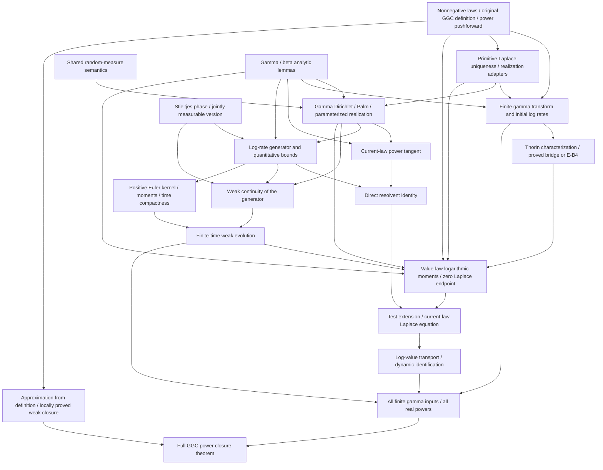

# Lean Blueprint for GGC Power Closure

The deliverable is a Lean proof of the main theorem: **every nonnegative GGC probability law remains GGC under every finite real power \(q\ge1\)**. Toolchain setup, definitions, and tangent identities are intermediate deliverables, not substitutes for that theorem.

As of **2026-09-23**, the initial Lean scaffold is present and **M0 is `in_progress`**. [lean-toolchain](lean-toolchain) pins Lean **4.32.2** and [lakefile.toml](lakefile.toml) pins mathlib revision **`905b95818eb32af7874a58b427f50c1711a5e96c`**. The human-audit entry point [main.lean](main.lean) contains the complete project-specific definitions and the named, **unproved** target proposition. [External/Bondesson.lean](External/Bondesson.lean) contains three fully stated literature assumptions; it proves none of them. [AxiomAudit.lean](AxiomAudit.lean) exposes the current declarations and their dependencies. Build evidence is recorded in the [README](README.md); the existence or successful compilation of this scaffold does not prove power closure.

M1 through M7 remain **`planned`**. Except for the existing files and declarations explicitly identified below, Lean paths and names remain **proposed**, not implemented APIs. The repository's "proved in project" status concerns the written mathematical argument; it does not establish Lean verification of the main theorem.

**Definition/helper migration implemented (2026-09-23):** `main.lean` now defines GGC by weak limits of actual finite gamma convolutions and contains all definitions required to read the target. Helpers have moved into `GGC/Basic.lean`, `GGC/FiniteGamma.lean`, `GGC/Laplace.lean` and `GGC/Thorin.lean`. Thorin representability is a separate predicate; its characterization remains M1 work under [Section 2.1](#original-ggc-definition). No E-B4 axiom was needed or introduced for this migration. The default build and updated audit pass; see the [migration evidence](#migration-acceptance-2026-09-23). The full power-closure proof remains unimplemented.

General rules and trust boundaries are in the [README](README.md); external inputs use its [single whitelist](README.md#external-inputs). This blueprint specifies dependencies, mathematical contracts, construction order, and acceptance criteria. The mathematical index is [WIP](../WIP.md); the main assembly and audit are [WIP-6.21](../ledger/23-power-theorem-assembly-audit.md#wip-6-21) and [WIP-6.23](../ledger/25-mathematical-completion-audit.md#wip-6-23).

## 1. Final theorem and required scope

For a real-valued probability law \(\mu\) concentrated on \([0,\infty)\), and \(q\in\mathbb R\) with \(1\le q\), prove

\[
\operatorname{IsGGC}(\mu)
\quad\Longrightarrow\quad
\operatorname{IsGGC}\bigl((x\mapsto x^q)_*\mu\bigr).
\]

The existing declaration `GGC.GGCPowerClosure : Prop` in [main.lean](main.lean) has this quantifier structure and now unfolds Section 2.1's original weak-limit definition. Defining a proposition does not prove or assume it. There is currently no declaration `GGC.ggc_rpow`; the required future theorem in `GGC/PowerClosure.lean` must prove this proposition without a core axiom or unfinished proof term. Its substantive hypotheses must be only nonnegativity of the probability law, GGC membership, and \(q\ge1\). Its scope includes:

- Every finite real exponent, including noninteger powers and \(q=1\), rather than only squares or a local interval of exponents.
- Arbitrary drift \(a\ge0\), infinite total Thorin mass, and nonatomic Thorin measures.
- All nonnegative degenerate laws, including \(\delta_0\) and \(\delta_a\). Random-variable values are finite real numbers; \(+\infty\) is not an additional value.
- No final assumptions of finite moments, finite logarithmic moments, finite Thorin mass, finite support, or zero drift.

First prove power closure for finite gamma convolutions. Then, for each fixed \(q\), use weak approximation and GGC weak closure. The second log-rate moments and construction constants may depend on each finite input and on \(T=\log q\). They need not be uniform over the approximating sequence. An evolution on an infinite time interval is not required.

## 2. Objects and interface conventions

Use a **law-first, supported-real** model. The implemented `GGC.NonnegLaw` in [main.lean](main.lean) wraps `MeasureTheory.ProbabilityMeasure ℝ` together with an a.e. nonnegativity proof for its underlying measure. That file owns all project-specific definitions required to read the main statement. The random-variable theorem is a future pushforward corollary. Choosing a common probability space, independent copies, or a path process must not become additional main-theorem hypotheses.

| Object | Current representation or remaining contract |
|---|---|
| Nonnegative value law \(\mu\) | `NonnegLaw` and `powerLaw μ q hq` are implemented in `main.lean`, where `hq : 0 ≤ q`. The definition uses the actual map \(x\mapsto x^q\), its continuity for nonnegative exponents, and a proof of nonnegative concentration. `powerLaw_toMeasure` exposes this semantics; `powerLaw_one` and `isGGC_powerLaw_one` supply the exponent-one sanity check. `GGC/Basic.lean` now proves fixed-power preservation of weak convergence as `power_pushforward_tendsto`. |
| Positive rate \(b\) | `PosReal := {b : ℝ // 0 < b}` is implemented in `main.lean`. Rate space and value space are distinct. Log rates live in \(\mathbb R\); future pushforwards under `exp` and `log` need measurability and inverse-map proofs. |
| Thorin data | `ThorinAdmissible` and `ThorinData` now live in `GGC/Thorin.lean`. They contain nonnegative drift \(a\), a positive rate measure \(U\), and `Integrable` for \(\log(1+1/b)\), without finite total mass. Integrability at every positive Laplace parameter and equivalence with the classical endpoint conditions remain proof obligations. These data describe the analytic characterization, not the original GGC definition. |
| GGC membership | Implemented: `IsGGC μ` means that \(\mu\) is a weak limit of actual finite gamma convolutions, as specified in Section 2.1. It has no Thorin-representation premise. |
| Thorin representability | The old existential formula is preserved as `HasThorinRepresentation` in `GGC/Thorin.lean`; `laplace` is in `GGC/Laplace.lean`. The still-planned characterization `isGGC_iff_hasThorinRepresentation` will connect it to `IsGGC`. Realization of arbitrary admissible data is the separate E-B1 existence input. |
| Finite gamma law | `gammaLaw`, `finiteGammaLaw`, and `IsFiniteGammaConvolution` are implemented with actual gamma measures and a finite product/sum pushforward in `main.lean`. No transform formula defines this class. Prove its transform separately with \(U=\sum_i\alpha_i\delta_{b_i}\). A nonempty input has \(B_0>0\); the empty product/sum gives \(\delta_0\). |
| Log-rate state \(F\) | `ProbabilityMeasure ℝ`, with an additional finite-second-moment hypothesis where needed. Set \(U=B\exp_*F\). Define coefficients for every probability \(F\), before proving Thorin admissibility, so the Euler iteration is not circular. |
| Evolution \(F_t\) | A narrowly continuous probability curve on a fixed finite interval \([0,T]\), with a uniform second-moment bound and the integral weak equation for the specified generator. The proposed `WeakLogRateSolution` packages properties to be proved; defining the structure does not construct an inhabitant. |
| Value and log-value laws | \(\mu_t\) is the zero-drift GGC law associated with \(U_t\); \(\lambda_t=(\log)_*\mu_t\). Prove \(\mu_t((0,\infty))=1\) before taking log values. \(F_t\) describes log **rates**, whereas \(\lambda_t\) describes log **values**. |
| Test functions | Specify predicates or structures for \(C_c^2(\mathbb R)\), linearly growing \(C^2\) functions with bounded first and second derivatives, and \(C_c^1((0,\infty))\). Moving between test domains requires an extension lemma. |

The initial files now select concrete imports and APIs in the pinned revision. Follow the README for their actual validation status. Further APIs for weak convergence, probability kernels, differentiation, and parameterized random measures must still be inspected and tested. Failure to find an API does not authorize narrowing these mathematical contracts.

### 2.1 Original definition and separate Thorin characterization

For \(k\in\mathbb N\) and shapes/rates \(\alpha_i,b_i>0\), define the finite gamma law by
\[
\operatorname{finiteGammaLaw}(k,\alpha,b)
 =\left(x\mapsto\sum_{i\in\mathrm{Fin}(k)}x_i\right)_*
   \bigotimes_{i\in\mathrm{Fin}(k)}\operatorname{Gamma}(\alpha_i,b_i).
\]
The product measure encodes independence. A law is `IsFiniteGammaConvolution` exactly when it equals such a pushforward. Shapes and rates may vary with every approximant, \(k=0\) is permitted, and no boundedness or uniform moment condition is added. The actual gamma law uses the shape/rate density already represented by mathlib's `ProbabilityTheory.gammaMeasure`; give the complete project wrappers in `main.lean` and prove their normalization and nonnegative concentration.

The public definition is
\[
\operatorname{IsGGC}(\mu)\;:\!\Longleftrightarrow\;
\exists(\mu_n)_{n\in\mathbb N},\quad
 (\forall n,\ \operatorname{IsFiniteGammaConvolution}(\mu_n))
 \ \land\ \mu_n\Rightarrow\mu.
\]
Use a sequence of `NonnegLaw` objects and `Tendsto` of their underlying `ProbabilityMeasure ℝ` values to `μ.law` in the weak topology. This statement does not quantify over a shared sample space or over Thorin data. If topology-based closure is used internally, prove its equivalence with this sequential definition. In particular, prove weak closure of this class locally by the sequential/closure bridge or a metric diagonal argument; it does not follow merely by unfolding one existential sequence.

Keep the analytic predicate separate:
\[
\operatorname{HasThorinRepresentation}(\mu)\;:\!\Longleftrightarrow\;
\exists a\ge0,\ U\ge0,\quad
 \int\log(1+1/b)\,U(db)<\infty,
\quad\forall s>0,\quad
 L_\mu(s)=\exp\{-as-\int\log(1+s/b)\,U(db)\}.
\]
`GGC/Thorin.lean` must expose `isGGC_iff_hasThorinRepresentation` for every `NonnegLaw`. It covers zero and constant laws, nonzero drift, nonatomic measures and infinite Thorin mass. This is a theorem or an adapter to an explicitly registered axiom, never the definition of `IsGGC`, and never a hypothesis added to `ggc_rpow`.

**Implementation-cost decision:** inspect the pinned source and try the small local adapters first. A modest characterization proof should be formalized. If the full characterization needs substantial new analysis, the user has authorized the standalone literature fallback E-B4 in the README whitelist; record the missing infrastructure and selected route without requiring another approval for that already authorized choice. The permitted routes are:

1. A proof from mathlib and local lemmas, with no external mathematical axioms in this characterization's dependency report.
2. A local Lean derivation from the already registered E-B2/E-B3: original GGC \(\Rightarrow\) representation uses the finite-gamma transform certificate and E-B2; representation \(\Rightarrow\) original GGC uses E-B3, that certificate and Laplace uniqueness. This may be a short bridge, but its dependencies are still literature axioms. Do not call it an axiom-free proof.
3. If substantial work remains, a precisely stated E-B4 `thorin_characterization` in `External/ThorinCharacterization.lean`, followed by a local adapter to the two public predicates. E-B4 repeats the actual finite-product gamma/weak-limit and measure/Laplace formulas in primitive terms, so it need not import `main`. Its scope is exactly the characterization; E-B1 realization remains separate. Avoid adding a redundant second characterization assumption when route 2 already settles the required bridge cheaply.

The source is Bondesson (1992), Section 3.1, printed p.29, Theorem 3.1.5 on p.34 and the finite-gamma approximation paragraph on p.35; see the existing [primary-interface audit](../notes/log-rate-power-proof-primary-interfaces.md). Before introducing E-B4, match both directions and the chosen admissibility convention to that source and record all local adaptations. This authorization does not allow axiomatizing power closure or any project evolution/identification result.

**Initial design API evidence, 2026-09-23 (before migration):** source-read only at the pinned mathlib revision: `Mathlib.Probability.Distributions.Gamma` supplies `ProbabilityTheory.gammaMeasure`, `ProbabilityTheory.isProbabilityMeasure_gammaMeasure`, and the gamma-integral argument used for normalization. No minimal compile or full characterization feasibility proof was performed in this design update. The eventual cost decision remains an implementation task; failure to find one guessed name is not evidence that the theorem must be axiomatized.

**Semantic acceptance:** print the full expansions of `gammaLaw`, `finiteGammaLaw`, `IsFiniteGammaConvolution`, the new `IsGGC`, `HasThorinRepresentation`, and the characterization. Check actual product-law independence and weak convergence. A single gamma law is GGC by a constant approximating sequence; \(\delta_0\) is the empty sum. For \(a>0\), supply the limiting argument \(\operatorname{Gamma}(n+1,(n+1)/a)\Rightarrow\delta_a\), or a proved characterization-based membership argument whose axiom dependencies are disclosed. The old `isGGC_diracLaw` proof only proves representability and cannot be reused unchanged as original-GGC membership.

## 3. Main dependency graph

Use the **direct log-generator resolvent verification** of [WIP-6.22](../ledger/24-direct-log-generator-resolvent.md#wip-6-22). This removes a dependency on the intermediate rate-coordinate operator. The general rate operator, conditional mass formula, and local continuation route in WIP-6.12--6.15 are optional extensions, not prerequisites for the first main-theorem implementation.

Node A's original-definition migration is implemented. E-B1--E-B3 are stated; H's local adapters or permitted E-B4 fallback remain planned. W will extract approximants from `IsGGC` itself and prove weak closure locally. External sources supply only the foundational inputs individually listed in the README. They do **not** supply the project generator, its continuity, the Euler limit, dynamic identification, or the main theorem. Each core node requires a Lean proof. A conditional assembly with a core premise does not complete that node or the main theorem and must not become a project axiom.

## 4. Existing scaffold, planned modules, and source mapping

Paths are relative to `formalization/`. The Lake library is `GGCPower`, with roots `main`, `GGC`, `External`, and `AxiomAudit`. Its globs include every `GGC` and `External` submodule. `main.lean` is the human-audit definition/statement entry point. The current files are:

| Existing file | Current contents and limits |
|---|---|
| [lean-toolchain](lean-toolchain), [lakefile.toml](lakefile.toml) | Pinned Lean/mathlib and the Lake library configuration. The generated `.lake` directory is excluded by the repository ignore rules. |
| [main.lean](main.lean) | Complete original GGC definition, actual gamma/product/sum and power laws, and the unproved `GGCPowerClosure` proposition. Only construction proofs remain here; no external import or auxiliary theorem. |
| [GGC/Basic.lean](GGC/Basic.lean) | Moved law/endpoint lemmas, the constant-law power identity, and fixed-power preservation of weak convergence. |
| [GGC/FiniteGamma.lean](GGC/FiniteGamma.lean) | Product/sum semantics, empty- and one-factor identities, finite-gamma and zero-law GGC membership via constant sequences. Transform certificates remain planned. |
| [GGC/Laplace.lean](GGC/Laplace.lean), [GGC/Thorin.lean](GGC/Thorin.lean) | Laplace definition, Thorin data, separate `HasThorinRepresentation`, and constant-law representability. Characterization and positive-constant GGC membership remain planned. |
| [External/Bondesson.lean](External/Bondesson.lean) | E-B1 `thorin_realization`, E-B2 `weak_closure`, E-B3 `finite_atomic_approximation`, with primitive measure/Laplace contracts and source annotations. These are explicit external axioms, not proved project deductions. |
| [External/README.md](External/README.md) | Inventory, exact scope, and local proof obligations. James, SSV, and Sethuraman interfaces are listed but have no Lean declarations yet. |
| [AxiomAudit.lean](AxiomAudit.lean) | Prints the current definitions, external contracts, and elementary lemma dependencies. Auditing the proposition definition does not prove its truth; the future theorem needs its own transitive audit. |

### 4.1 Approved separation of statement and proof

`main.lean` remains the **definition and statement entry point**. The future **proof entry point** is `GGC/PowerClosure.lean`, and `AxiomAudit.lean` is the verification entry point. This supersedes the earlier plan for `main.lean` to import the proof modules and contain their adapters and final theorem.

The first migration has the following exact ownership:

| Destination | Declarations or responsibility |
|---|---|
| Keep or define in `main.lean` | `PosReal`, `NonnegLaw`, `gammaLaw`, `finiteGammaLaw`, `IsFiniteGammaConvolution`, the original-definition `IsGGC`, `powerLaw`, and `GGCPowerClosure`, with complete definitions and explanatory comments. Proof fields needed to construct these objects, including probability normalization and nonnegative concentration, remain with their definitions. Section 2.1 supersedes the earlier plan to retain the representation-based definition. |
| Move to `GGC/Basic.lean` | `NonnegLaw.ext`, `powerLaw_toMeasure`, `powerLaw_one`, `diracLaw`, and `isGGC_powerLaw_one`. Preserve the unaffected declarations; check the last lemma against the new membership predicate. `diracLaw` is not required to read the main target. |
| Move to `GGC/Laplace.lean` and `GGC/Thorin.lean` | `laplace` belongs to the former; `ThorinAdmissible`, `ThorinData`, `thorinLaplace`, and the old existential formula renamed `HasThorinRepresentation` belong to the latter. They are no longer definitions needed to read the public target. Thorin also owns the characterization adapter and the revised `isGGC_diracLaw`; its old proof becomes a representability lemma, followed by a membership proof as required in Section 2.1. |
| Prove in `GGC/FiniteGamma.lean` and `GGC/WeakClosure.lean` | The former proves the actual finite-sum transform certificate and membership via constant sequences, including the empty sum. The latter proves weak closure of the original class locally; it imports `GGC.Basic`, not `GGC.Thorin` or the external characterization. |
| Prove later in `GGC/Reduction.lean` | The conditional reduction from finite-gamma power closure to the full target, extracting approximants from the original definition and using fixed-power continuity and locally proved GGC weak closure. E-B2/E-B3 are not needed by this reduction. Its finite-input premise remains explicit until discharged. |
| Prove later in `GGC/PowerClosure.lean` | `finiteGamma_power_closure`, `ggc_rpow : GGCPowerClosure`, and the random-variable corollary, assembled from the completed proof modules and reduction. Do not create an unfinished theorem under the final name to enact the file split. |
| Update `AxiomAudit.lean` | Import the implemented definition/helper/characterization modules and external declaration modules explicitly. Print both predicates, the characterization, and the dependencies of the revised membership lemmas; print E-B4 only if actually introduced. Once the genuine final proof exists, also import `GGC.PowerClosure` and audit `GGC.ggc_rpow`. |

**Implemented import direction:** `GGC.Basic` imports `main`; other proof modules import definitions and helpers as needed. `AxiomAudit` explicitly imports `GGC.FiniteGamma`, `GGC.Thorin` and `External.Bondesson`. `main` imports mathlib only; it must not import its consumers. The future `GGC.PowerClosure` will import its completed proof dependencies. The primitive Bondesson contracts are unchanged and still do not depend on `main`.

**Shared semantics before deferred external contracts:** the proposed `GGC/Foundations/RandomMeasure.lean` owns the actual random-measure evaluation and Dirichlet-law semantics needed by E-J1--E-J3 and E-T1. It imports mathlib only, with no external axioms or project proof modules. Those future external files may import this foundation; `GGC/GammaDirichlet.lean` then imports the registered external contracts and proves the local constructions. The two dependency branches are `mathlib → main → project lemmas` and `mathlib → shared semantics → external contracts`; they feed the proof modules, then `GGC.PowerClosure`, then `AxiomAudit`. Here arrows point from a dependency to its consumer. This foundation does not relocate the public definitions currently owned by `main.lean`. Fix this interface at the start of M2, before introducing the deferred axioms; it is not an unlisted prerequisite for finishing M0.

Migration acceptance requires the original GGC definition and all its prerequisites in `main`, the same full target quantifiers, unchanged types and axiom dependencies for unaffected moved lemmas, and fresh semantic/dependency checks for membership lemmas and the characterization. Require an acyclic import graph and a default Lake build covering the new `GGC` modules and updated audit. Update module coverage when creating those files; the existing roots/globs only name `main`, `External`, and `AxiomAudit`. Record the actual configuration and successful checks. This accepts the definition/helper migration and any completed characterization work, not the future main proof; a build of `main` alone cannot certify that proof. The definition/helper migration, Lake coverage and audit updates are now implemented and checked; see the migration acceptance record below. Characterization and full-proof acceptance remain separate.

### 4.2 Planned proof modules

The following proof decomposition remains **`planned`**, except for the existing and partially implemented modules explicitly inventoried above. Local adapters belong in the module responsible for the relevant mathematics. They may refer to the public definitions by importing `main`; reusable primitive-measure lemmas remain welcome but are no longer required merely to avoid importing it. The final theorem belongs to `GGC/PowerClosure.lean`.

| Proposed file | Proposed declarations or deliverable | Written proof and manuscript locator |
|---|---|---|
| `GGC/Basic.lean` | The existing basic declarations listed in Section 4.1, followed by `power_pushforward_weaklyContinuous` and its `NonnegLaw`/`powerLaw` adapter; imports `main` | [main.lean](main.lean), existing helper proofs; [WIP-0.1](../ledger/00-foundations.md#wip-0-1); [completion section](../manuscript/sections/06-completion.tex) |
| `GGC/Laplace.lean` | `laplace`, `nonnegLaw_eq_of_laplace_eq`, Laplace normalization/positivity/integrability; primitive probability-measure statements with no moment assumptions. Realization adapters using Thorin data belong to `GGC.Thorin`, avoiding a reverse import | [foundations](../manuscript/sections/01-foundations.tex), `lem:gamma-dirichlet`; [identification](../manuscript/sections/05-identification.tex), transform-uniqueness argument following `eq:id-positive-log`; E-B1 local obligations |
| `GGC/FiniteGamma.lean` | Product/sum semantics lemmas, scalar and finite-sum Laplace formulas, finite-gamma membership and zero-law membership via constant sequences; imports `GGC.Basic` and `GGC.Laplace`, not `GGC.Thorin` | Section 2.1; [foundations ledger](../ledger/00-foundations.md) |
| `GGC/WeakClosure.lean` | Sequential/closure equivalence or metric diagonal construction, then `isGGC_of_tendsto`; consumes the original definition and `GGC.Basic`, with no Thorin-characterization dependency | Section 2.1; [preliminaries](../manuscript/sections/01-foundations.tex), `lem:ggc-closure` |
| `GGC/Thorin.lean` | Thorin data and `HasThorinRepresentation`, integrability and derivative lemmas, realization adapters, `isGGC_iff_hasThorinRepresentation`, `hasThorinRepresentation_diracLaw`, and revised `isGGC_diracLaw`; imports finite-gamma/Laplace results and only the external contracts actually used | Section 2.1; [foundations ledger](../ledger/00-foundations.md); [preliminaries](../manuscript/sections/01-foundations.tex), `eq:thorin-representation` |
| `GGC/Reduction.lean` | Conditional finite-gamma-to-general reduction; consumes `GGC.Basic`, `GGC.WeakClosure`, and approximation from the original definition; no final theorem assumed or claimed | [WIP-6.21](../ledger/23-power-theorem-assembly-audit.md#wip-6-21); [completion section](../manuscript/sections/06-completion.tex) |
| `GGC/Foundations/RandomMeasure.lean` | Actual random-measure evaluation, finite-partition Dirichlet semantics including zero-mass cells, and required measurable structures; no project conclusions or external axioms | [foundations](../manuscript/sections/01-foundations.tex), Dirichlet-process convention; [measurable realizations](../manuscript/sections/07-measurable-realizations.tex); E-J1--E-J3 and E-T1 prerequisites |
| `GGC/GammaAnalysis.lean` | Gamma/beta density conventions, digamma semantics, gamma and beta logarithmic integrals, and uniform bounds on compact positive mass intervals; reuse mathlib and prove missing analytic adapters locally | [tangent](../manuscript/sections/02-power-tangent.tex), proof of `lem:tangent`; [generator](../manuscript/sections/03-log-generator.tex), proof of `lem:bounds`; [identification](../manuscript/sections/05-identification.tex), `eq:id-log-moment` |
| `GGC/GammaDirichlet.lean` | `dirichletMean_laplace`, `tiltedLaw_eq_gammaDirichlet`, `posterior_palm`, `parameterized_dirichlet`, and the locally proved Dirichlet pushforward adapters connecting log-rate and positive-rate bases | [WIP-6.11](../ledger/19-finite-thorin-compensated-power-tangent.md#wip-6-11), [WIP-6.16](../ledger/20-finite-thorin-positive-steps.md#wip-6-16); [measurable realizations appendix](../manuscript/sections/07-measurable-realizations.tex), `lem:parameterized-dirichlet` |
| `GGC/StieltjesPhase.lean` | `phase_jointlyMeasurable`, `phase_anchor_one`, `phase_unique_ae`, `phase_integrals_tendsto` | [WIP-6.11](../ledger/19-finite-thorin-compensated-power-tangent.md#wip-6-11), [WIP-6.18](../ledger/21-log-thorin-euler-evolution.md#wip-6-18); [preliminaries](../manuscript/sections/01-foundations.tex), `lem:phase` |
| `GGC/PowerTangent.lean` | `currentLaw_power_tangent`, `normalized_power_tangent`, `power_tangent_eq_deriv_s_mul_tilted_logMoment` | [WIP-6.11](../ledger/19-finite-thorin-compensated-power-tangent.md#wip-6-11); [tangent section](../manuscript/sections/02-power-tangent.tex), `lem:tangent`; [identification](../manuscript/sections/05-identification.tex), `eq:id-current-tangent` |
| `GGC/LogRate/Generator.lean` | `jumpMeasure`, `correctionKernel`, `logDrift`, `acceptance`, `logGenerator`; joint measurability | [WIP-6.16](../ledger/20-finite-thorin-positive-steps.md#wip-6-16); [generator section](../manuscript/sections/03-log-generator.tex), `eq:generator` |
| `GGC/LogRate/Bounds.lean` | `correctionKernel_integrable`, `jump_secondMoment_finite`, `drift_linear_bound`, quadratic Lyapunov bound | [WIP-6.17](../ledger/20-finite-thorin-positive-steps.md#wip-6-17); [generator section](../manuscript/sections/03-log-generator.tex), `lem:bounds` |
| `GGC/LogRate/Resolvent.lean` | `direct_resolvent_cancellation`, `averaged_generator_resolvent` | [WIP-6.22](../ledger/24-direct-log-generator-resolvent.md#wip-6-22); [generator section](../manuscript/sections/03-log-generator.tex), `lem:generator` |
| `GGC/LogRate/Continuity.lean` | `averaged_generator_continuous`, uniform boundedness for compact tests over all states and masses in a compact positive interval | [WIP-6.18](../ledger/21-log-thorin-euler-evolution.md#wip-6-18); [evolution section](../manuscript/sections/04-evolution.tex), `lem:continuity` |
| `GGC/LogRate/Euler.lean` | `positiveEulerKernel`, exact one-step moments, uniform second moments, time modulus, cumulative consistency error | [WIP-6.19](../ledger/21-log-thorin-euler-evolution.md#wip-6-19); [evolution section](../manuscript/sections/04-evolution.tex), `eq:positive-euler-kernel` through `eq:euler-total-error` |
| `GGC/LogRate/Existence.lean` | `exists_weakLogRateSolution` | [WIP-6.19](../ledger/21-log-thorin-euler-evolution.md#wip-6-19); [evolution section](../manuscript/sections/04-evolution.tex), `thm:evolution` |
| `GGC/Identification/Moments.lean` | `valueLaw_logMoment_bound`, strict positivity, narrow continuity of value laws, Thorin admissibility | [WIP-6.20, Sections 1--2](../ledger/22-power-flow-identification.md#wip-6-20); [identification section](../manuscript/sections/05-identification.tex), `eq:id-log-moment` |
| `GGC/Identification/WeakEquation.lean` | Test-domain extension, `tangent_spaceTime_integrable`, `zero_endpoint_bound`, `laplace_weak_equation`, `value_weak_equation` | [WIP-6.20, Sections 3--7](../ledger/22-power-flow-identification.md#wip-6-20); [identification section](../manuscript/sections/05-identification.tex), `eq:id-absolute-fubini`, `eq:id-value-weak` |
| `GGC/Identification/Transport.lean` | `log_value_transport_unique`, `identify_power_flow` | [WIP-6.20, Section 8](../ledger/22-power-flow-identification.md#wip-6-20); [identification section](../manuscript/sections/05-identification.tex), `thm:identification` |
| `GGC/PowerClosure.lean` | `finiteGamma_power_closure`, `ggc_rpow : GGCPowerClosure`, and random-variable corollary; imports the completed construction, identification and reduction modules, and serves as the final proof entry point | [WIP-6.21](../ledger/23-power-theorem-assembly-audit.md#wip-6-21); [completion section](../manuscript/sections/06-completion.tex); [full-scope audit](../ledger/25-mathematical-completion-audit.md#wip-6-23) |

WIP-6.23 audits the assembled proof; it is not a second independent theorem. Exact foundational source interfaces are recorded in the [primary-interface audit](../notes/log-rate-power-proof-primary-interfaces.md) and the README whitelist. Parameterized realizations, measurable representatives, and their subsequent applications still require project proofs.

## 5. Critical mathematical contracts

### Foundational adapters shared by the proof nodes

`GGC/Laplace.lean` must prove that two nonnegative probability measures with the same Laplace transform at every positive parameter are equal, without extra moments. E-B1 gives existence only; use this uniqueness to identify its realization with gamma sums and gamma--Dirichlet products, and to identify subsequential limits in M6. Choosing one E-B1 witness does not itself prove continuity or measurability as its data vary. Those properties remain outputs of `Identification/Moments.lean`, using the logarithmic tail bounds. For the supported-real model, also justify the passage to probabilities on the positive subtype and continuity of the log pushforward; `Real.log` is not continuous at zero.

`GGC/GammaAnalysis.lean` must use shape/rate gamma conventions and actual beta laws; below \(B>0\) and \(G_B\sim\mathrm{Gamma}(B,1)\) has unit rate. Set \(\psi=\Gamma'/\Gamma\) on positive arguments (or prove equivalence with a reused definition), and supply
\[
\mathbb E[G_B\log G_B]=B\psi(B+1),\qquad
\mathbb E[-\log Z]=\psi(B+1)-\psi(1),\quad Z\sim\mathrm{Beta}(1,B),
\]
with absolute integrability, as well as the gamma negative-log bound \(\mathbb E(\log G_B)^-\le[\Gamma(B)B^2]^{-1}\). Supply continuity and bounds for these constants on compact subsets of \((0,\infty)\). These are local analytic obligations, not extra conclusions supplied by E-J1 or E-J3.

### A. Current-law tangent and measurable phase

The input is any admissible, nonzero, finite Thorin measure \(U\), of mass \(B>0\), with its associated zero-drift value law \(\mu\). For \(P\sim DP(U)\) and \(s>0\), define

\[
M_P(s)=\int\frac{P(db)}{s+b},\qquad
W_P(s)=\int\frac{b\,P(db)}{(s+b)^2},\qquad
g(s)=-\partial_s\log L_\mu(s).
\]

Deliver the actual power derivative
\(h_U(s)=\left.\partial_q[-\partial_s\log L_{\operatorname{powerLaw}(\mu,q)}(s)]\right|_{q=1}\), together with

\[
\frac{h_U(s)+g(s)}B
=\mathbb E\bigl[W_P(s)\{\psi(B+1)+1+\log M_P(s)\}\bigr].
\]

This is differentiability at the **current law**; it does not assume that any positive-time power is GGC. Exponential tilting needs a marginal distribution identity for each \(s\), not a joint coupling assertion about the original tilts.

The tangent module must also deliver the bridge consumed by identification. With
\[
A_U(s)=\frac{\int x\log x\,e^{-sx}\,\mu(dx)}{L_\mu(s)},
\qquad h_U(s)=\partial_s\{sA_U(s)\},
\]
prove the second equality for the actual power derivative defined above, not as a new definition of an unrelated tangent. Establish the required mixed differentiation and domination locally on compact positive \((s,q)\)-intervals around \(q=1\), and positivity of the normalizer. The bounds apply under the tilted integrals and require no un-tilted \(X\log X\) moment.

For the phase, deliver \(0\le\xi_P(t)\le1\), joint Borel measurability in \((P,t)\), the anchor-one formula, and a.e. uniqueness:

\[
\log M_P(s)-\log M_P(1)
=\int_0^\infty\xi_P(t)\left(\frac1{s+t}-\frac1{1+t}\right)dt.
\]

Construct a specific representative using the boundary `limsup` along integers \(n\ge1\). Separate external existence of a bounded phase representation from the project's jointly measurable version. Do not assume convergence at every boundary point or add \(M_P(0)<\infty\).

### B. The specified generator and its resolvent identity

Define \(a_{B,F}\) and \(k_{B,F}\) exactly as in [WIP-6.16--6.17](../ledger/20-finite-thorin-positive-steps.md). The Palm posterior is \(DP(U+\delta_b)\), but the tangent's digamma coefficient remains \(\psi(B+1)\), using the original mass. The generator is

\[
\mathcal G_{B,F}\varphi(y)=a_{B,F}(y)\varphi'(y)
+\int_{\mathbb R}[\varphi(y+v)-\varphi(y)-v\varphi'(y)]
 k_{B,F}(y,v)\,\nu_0(dv),\qquad
\nu_0(dv)=\frac{dv}{4\sinh^2(v/2)}.
\]

The reference measure has no atom at zero. Compensation covers **all** jump sizes. First prove \(K\in L^1\), \(m_2=\int v^2\nu_0(dv)<\infty\), \(0\le k\le1\), and \(|a-y|\le C_I\). For \(B\in I\Subset(0,\infty)\), the constants must be independent of \(F,y\). The main proof needs only finiteness of \(m_2\); its closed form \(2\pi^2/3\) need not add a dependency.

For \(\varphi_s(y)=(s+e^y)^{-1}\), prove

\[
F(\mathcal G_{B,F}\varphi_s)=\frac{h_U(s)+g(s)}B.
\]

The proof sequence is: algebraic cancellation of combined kernels; absolute integrability of each term used; the sample identity; an absolute posterior drift bound; then signed Palm/Fubini. Integrate the three terms defining \(K\) together, rather than splitting divergent integrals and cancelling them afterward. Use [WIP-6.22](../ledger/24-direct-log-generator-resolvent.md#wip-6-22).

### C. Continuity, positive discrete kernels, and existence

The continuity contract is: if \(B_n\to B>0\), \(F_n\Rightarrow F\), and \(y_n\to y\), then for every \(\varphi\in C_c^2\),
\(\mathcal G_{B_n,F_n}\varphi(y_n)\to\mathcal G_{B,F}\varphi(y)\); consequently \(H_\varphi(B,F)=F(\mathcal G_{B,F}\varphi)\) is continuous. Use common uniforms, quantiles, stick-breaking, and weak-star phase convergence against \(L^1\) kernels. Pointwise continuity of boundary phases cannot replace this argument. In stick-breaking, the independent variables are the Beta break fractions \(V_j\) and the locations, not the weights \(W_j=V_j\prod_{i<j}(1-V_i)\).

This interface also supplies, for every compact positive mass interval \(I\), a finite constant \(C_{I,\varphi}\) with
\(\sup_{B\in I,F,y}|\mathcal G_{B,F}\varphi(y)|\le C_{I,\varphi}\).
Derive it from B's drift bound and compact support of \(\varphi'\). Use it with local uniform convergence and tightness to integrate against varying \(F\), and later to pass through the time integral. Joint continuity alone does not supply this bound on the noncompact state space.

For an Euler step, take **\(0<h\le1/16\)**, \(\epsilon=\sqrt h\), and freeze \(B,F\). In the finite-horizon construction choose \(h=T/N\) with \(N\ge1\) large enough to meet this bound, and let \(N\to\infty\). Set

\[
\lambda_\epsilon(y)=\int_{|v|>\epsilon}k(y,v)\nu_0(dv),\quad
m_\epsilon(y)=\int_{|v|>\epsilon}vk(y,v)\nu_0(dv),\quad
a_\epsilon=a-m_\epsilon,\quad p=1-h\lambda_\epsilon.
\]

The actual iteration kernel must be

\[
\Pi_h(y,dz)=p(y)\delta_{y+h a_\epsilon(y)/p(y)}(dz)
+h\int_{|v|>\epsilon}\delta_{y+v}(dz)k(y,v)\nu_0(dv).
\]

Prove the uniform truncation bound \(\lambda_\epsilon(y)\le2/(e^\epsilon-1)\le2/\epsilon\), so \(p(y)\ge1-2\sqrt h\ge1/2\). This is a small-step contract, not a claim for arbitrary positive \(h\).

Acceptance requires kernel measurability, \(p\ge1/2\), total mass exactly one, the exact mean \(\mathbb E(\Delta\mid y)=ha(y)\), and the second-moment recursion, for the admissible steps just specified. Prove uniform tightness and time control, and choose a subsequence independently of the test function. The cumulative error must vanish, for example through
\(C[\sqrt h+h(1+|\log h|^2)]\to0\).

The existence output must be precisely: for every \(B_0>0\), probability \(F_0\) with finite second moment, and \(T>0\), there is a narrowly continuous \(F_t\) with the prescribed initial state, a uniform second-moment bound, \(B_t=B_0e^{-t}\), and

\[
F_t(\varphi)-F_0(\varphi)
=\int_0^t F_r(\mathcal G_{B_r,F_r}\varphi)\,dr
\qquad(\varphi\in C_c^2,\ 0\le t\le T).
\]

A positive minimum property, a formal tangent, or positivity of one step does not satisfy this existence contract. Do not replace the construction with an unproved general nonlinear-generator existence axiom.

### D. Endpoint control, dynamic identification, and final assembly

The identification theorem consumes exactly C's output and uses the same \(\mathcal G\). First prove admissibility of \(U_t=B_t\exp_*F_t\), strict positivity and narrow continuity of its value law \(\mu_t\), and

\[
\sup_{t\le T}\int|\log x|\,\mu_t(dx)<\infty.
\]

Extend the weak equation by cutoffs to linearly growing tests with bounded derivatives. Combine it with B's resolvent identity; \(B_t'=-B_t\) cancels the extra \(g_t\) term. For \(A_t(s)=\mathbb E_{t,s}[X\log X]\), consume A's derivative bridge and prove the expanded identity
\[
h_t(s)=\partial_s\{sA_t(s)\}
=A_t(s)-s\mathbb E_{t,s}[X^2\log X]
 +s\mathbb E_{t,s}[X]A_t(s).
\]
The zero-endpoint contract is all of the following, for every fixed \(s_0>0\):

- A Borel probability kernel \(t\mapsto\mu_t\), and joint measurability of \(A_t(s)\) and \(h_t(s)\) on \([0,T]\times(0,\infty)\).
- A uniform positive lower bound \(L_t(s)\ge D:=\exp\{-B_0[\log(1+s_0)+\sqrt{K_T}]\}>0\) for \(0<s\le s_0\), where \(K_T=\sup_{0\le t\le T}F_t(y^2)\).
- Absolute space-time integrability of **\(h\)**, including its product term:
  \[
  \int_0^T\int_0^{s_0}|h_t(s)|\,ds\,dt
  \le T\left(2D^{-1}+(eD^2)^{-1}\right)C_{\log,T}<\infty,
  \]
  where \(C_{\log,T}\) bounds \(\int|\log x|\,\mu_t(dx)\). For the product term use \(s\mathbb E_{t,s}X\le(eD)^{-1}\) and \(\int_0^{s_0}|A_t(s)|\,ds\le D^{-1}C_{\log,T}\).
- For each fixed \(t\), \(sA_t(s)\to0\) as \(s\downarrow0\), with \(|sA_t(s)|\le C_{\log,T}/(eD)\). This bound permits dominated convergence in time; uniform convergence in \(t\) is not required.

Only then conclude \(\int_0^s h_t(r)\,dr=sA_t(s)\), perform time--Laplace Fubini, and normalize at \(s=0\). Integrability of \(A\) and its boundary limit alone do not prove integrability of its differentiated expression \(h\). Do not assume \(\mathbb E|X\log X|<\infty\) for the original value laws. The source for this complete contract is `eq:id-tangent-expanded` through `eq:id-zero-endpoint` in the [identification section](../manuscript/sections/05-identification.tex).

Approximate simultaneously in the norms of the **test function and its generator** to derive

\[
\mu_t(H)-\mu_0(H)=\int_0^t\mu_u(x\log x\,H'(x))\,du
\qquad(H\in C_c^1((0,\infty))).
\]

For \(\lambda_t=(\log)_*\mu_t\), obtain the transport equation with velocity \(z\). Prove uniqueness using partition sums and backward tests \(\zeta_u(z)=\zeta(e^{t-u}z)\), yielding
\(\mu_t=(x\mapsto x^{e^t})_*\mu_0\). This is a dynamic identification; resemblance between two static transform formulas is insufficient.

Finally take \(T=\log q\) for the finite gamma theorem and handle \(q=1\) separately. For general GGC inputs, use \(\mu_n\Rightarrow\mu\), continuity of the fixed power map, and GGC weak closure. The weak limit is the actual probability law \(\operatorname{powerLaw}(\mu,q)\), with no loss of mass. The general input must not inherit C's moment assumptions.

## 6. Milestones and acceptance gates

Change a milestone's status only after providing checkable Lean declarations, dependencies, and build evidence. Completing a stage does not automatically verify the main theorem. If explicit external assumptions remain, use the README's relative-verification designation.

| Stage | Status | Deliverables and acceptance criteria |
|---|---|---|
| M0: Reproducible project and fixed interfaces | `in_progress` | Pins, the original-definition migration, separate helper modules, three unchanged Bondesson contracts and updated build/audit coverage are implemented. Empty-sum, single-gamma, exponent-one and constant-power cases pass. Laplace integrability, normalization and positivity remain open. Deferred Dirichlet/phase external contracts belong to M2's gate. A compiling target is not a proved theorem. |
| M1: Characterization and final reduction | `planned` | Prove finite-gamma transform certificates and the separate Thorin characterization, following Section 2.1's cost decision and authorized fallback if needed. Audit its actual assumptions. Prove original-GGC weak closure locally and the conditional reduction in `GGC/Reduction.lean`, using approximation directly from the definition. This is only a conditional assembly until the finite-input premise is proved. |
| M2: Dirichlet theory, phases, and tangent | `planned` | First freeze the shared random-measure semantics and fully state/audit the deferred external contracts, including the complex-domain input needed for the chosen phase construction. Then complete A's contracts and the required gamma/beta analytic lemmas. Cover atomic, nonatomic, and mixed bases in posterior identities. Supply a fixed common probability space and joint measurability for parameterized random measures. Distinguish external representation inputs from project measurable constructions. |
| M3: Generator and direct resolvent | `planned` | Complete B's contracts, with absolute integrability and the correct digamma parameter. No hidden rate-moment or log-rate-moment restrictions. The deterministic cancellation may be implemented first as an independent lemma. |
| M4: Weak continuity | `planned` | Prove phase convergence against every \(L^1\) kernel, joint parameter continuity, and continuity after integration against varying measures. No pointwise phase convergence hypothesis. |
| M5: Positive Euler scheme and finite-time existence | `planned` | Prove C's kernel, exact moments, tightness, uniform-in-time narrow convergence, consistency, and limiting weak equation. Match the identification input property by property, for every test and every time. |
| M6: Dynamic identification | `planned` | Prove D's logarithmic moments, strict positivity, endpoint bounds, test-domain extension, and transport uniqueness. Identify every solution of the specified weak equation with the actual power laws, without assuming future power closure. |
| M7: Full main theorem | `planned` | Assemble the finite gamma theorem and general GGC reduction in `GGC/PowerClosure.lean`, retaining every quantifier in Section 1. `import GGC.PowerClosure` exposes the theorem; the default build and `AxiomAudit.lean` include this proof entry point; a clean build succeeds; the dependency/axiom report meets README rules; no core node remains an unproved assumption. Disclose the status of every remaining external input. |

M0's acceptance checklist is:

1. Reproduce the pinned version, default build, and existing audit; record the actual executable, working directory, commands and exit statuses, distinguishing cached validation from a clean rebuild. The 2026-09-23 review passed the cached build and direct audit; see the README evidence.
2. Inspect the complete target quantifiers and public definitions, the three existing E-B contracts and their source adaptations, and the actual import/axiom graph. The original-definition semantics now pass the migration audit; no theorem identifying them with Thorin representability is claimed. No core axiom or unfinished proof may enter the verified closure.
3. The \(q=1\) lemmas, single-gamma and empty-sum membership cases, and actual power-pushforward identity for \(\delta_a\) are now proved. Still required: Laplace integrability, normalization at zero and positivity at positive arguments, via `GGC/Laplace.lean`. The revised positive-constant membership proof belongs to M1 if it uses the characterization; the former representability proof does not discharge it.
4. Implement and validate Section 2.1's original definition and Section 4.1's ownership changes, preserving the full target quantifiers and checking changed membership semantics explicitly. Update Lake module coverage and audit imports together. This migration is complete; the characterization remains M1 work and no unfinished final theorem was introduced.

Once the current public signatures are fixed, M1's weak reduction, M2's shared-semantics and deferred-contract gate, and M3's deterministic kernel estimates may proceed in parallel; they need not wait for the unrelated remaining M0 endpoint proofs. M5's probability-kernel and compactness infrastructure can begin once its precise continuity interface is fixed. Merge parallel work by checking contracts, not file or declaration counts.

## 7. Risks and execution starting point

| Risk | Required response |
|---|---|
| Unverified mathlib APIs | Use the pinned revision, inspect declarations, and compile minimal examples. Initial API choices do not validate later weak-convergence or random-measure interfaces. Prove missing adapters or record a specific gap. Do not invent imports or strengthen the main theorem's hypotheses. |
| Probability-valued measurability and common null sets | Follow the common-event construction in the [measurable realizations appendix](../manuscript/sections/07-measurable-realizations.tex) for quantiles, stick-breaking, and the Palm kernel. Do not intersect uncountably many parameter-dependent full-measure events. |
| Default integral values hiding divergence | Prove absolute integrability before splitting, substitution, Fubini, or differentiation. In particular audit \(K\), signed Palm, and the product term at the zero Laplace endpoint. |
| Discontinuous boundary phases | Use boundedness, a.e. uniqueness, and weak-star convergence against \(L^1\) kernels. Do not depend on pointwise phase continuity. |
| Mistaking tangent positivity for existence | M5 must construct an actual probability-kernel iteration, a probability limit, and the exact weak equation. A positive-minimum-property placeholder is insufficient. |
| Unproved extension of test domains | Do not insert resolvent or logarithmic tests directly into the original \(C_c^2\) equation. Verify cutoff limits and space-time domination separately. |
| A theorem covering only restricted inputs | Audit every parameter of `ggc_rpow`; remove shape, mass, support, drift, or moment restrictions belonging only to intermediate construction. Check \(q=1\), \(\delta_0\), and positive drift. |
| A mismatch with the written proof | Locate the issue by WIP ID and manuscript label; repair the proof or contract and update status. Do not absorb a mathematical gap into an external axiom. |

**Next implementation handoff:** the original-definition and ownership/audit/build migration is complete. Complete M0's remaining Laplace checks, assess the characterization cost under Section 2.1, and implement M1's chosen bridge, local weak closure and conditional reduction. Keep the statement layer independent of that bridge. M2's shared semantics and deferred contracts, and deterministic resolvent/kernel estimates can proceed independently once their interfaces are fixed. Supply `GGC.ggc_rpow` in `GGC/PowerClosure.lean` only when its genuine proof is ready. Generating core theorem stubs containing `sorry` is not progress. The present migration does not implement those remaining proof stages.

For each completed module, record the actual file, Lean declaration, precise WIP/manuscript source, verification command, and external-dependency status here or in the adjoining progress record. Retain the proposed label for nonexistent files. Completion evidence must be the main theorem's actual type, a dependency tree without core gaps, and a reproducible build, rather than this blueprint itself.

## 8. Design review and engineering acceptance — 2026-09-23

Scope: compare this blueprint with the existing scaffold, external inventory, manuscript and written proof ledgers; revise design contracts and run the existing acceptance commands. No Lean implementation, external axiom, toolchain pin or manuscript was changed. This was not a new primary-literature audit or a proof of the planned Lean nodes.

| Review ID | Finding and consequence | Design resolution and remaining acceptance |
|---|---|---|
| R1 — high | C previously allowed arbitrary \(h>0\) while requiring \(p\ge1/2\). The source requires small steps. For \(F=\delta_y\), \(k(y,v)=1_{v>0}\) a.e.; at \(h=4\), \(p=1-4/(e^2-1)<1/2\). | Restrict \(h=T/N\le1/16\) and expose the uniform truncation estimate. M5 must still prove this contract. |
| R2 — high | The power-derivative-to-\(s\)-derivative bridge was implicit, and the zero-endpoint wording did not identify \(h\) as the function needing absolute space-time integrability. The missing distinction could leave time--Laplace Fubini unjustified. | A now exports the bridge; D lists \(h\)'s three terms, its \(L^1\) bound including the product term, and the pointwise endpoint limit with time domination. M2/M6 remain planned. |
| R3 — medium | Laplace uniqueness and gamma/beta analytic dependencies had no explicit module owner; the graph omitted the Dirichlet input used by value-law logarithmic moments. | Add planned primitive Laplace, gamma-analysis and shared-semantics modules, and the missing dependency edges. Also expose C's uniform compact-test bound. These are contracts, not new proved lemmas. |
| R4 — medium | M0 required all deferred external semantics, while M2 and its prerequisite semantic module were scheduled only afterward. The module tree did not assign that shared foundation, and M0's remaining checks were unspecified. | Assign shared semantics and deferred contracts to M2's initial gate, list M0's remaining checks, and allow independent work once the public interfaces are frozen. No actual import cycle was found in the existing scaffold. |
| R5 — medium | Generic `lake` commands did not replay in this review environment: the elan shim reported `couldn't find value of ELAN_HOME`. Earlier evidence did not record the actual executable path. | The pinned toolchain's executable passed version/build/audit. Record the exact invocation and cached-build limit in the README; no environment or code change was made. |

Acceptance verdict: the existing statement/scaffold and its documented axiom boundary pass the checks run in this review. **M0 remains `in_progress`; M1--M7 remain `planned`; the main theorem is not accepted as implemented or proved.** No scope conflict was found for noninteger powers, \(q=1\), drift, infinite Thorin mass, nonatomic inputs or degenerate laws. The contract corrections above do not by themselves change the written argument's research status.

Subsequent design decision on the same date: the user approved storing proof details separately while retaining complete definitions in `main.lean`. Section 4.1 records that approved migration and supersedes the former plan to assemble the proof in `main`. The review/build evidence above predates the migration; no file movement or new proof verification is claimed by this design update.

Further approved decision on the same date: use the original finite-gamma weak-limit definition of `IsGGC` in `main`; move Thorin representability to a separate characterization. Section 2.1 records proof-first implementation and the authorized E-B4 literature fallback if the work is substantial. The previous acceptance record concerns the old representation-based scaffold only. Neither the semantic migration nor a characterization proof/axiom has been implemented by this documentation update.

## 9. Original-definition migration acceptance — 2026-09-23

This implementation follows the approved Sections 2.1 and 4.1 design and
supersedes their earlier "not implemented" status descriptions. It does not
change the historical design-review results in Section 8.

- `main.lean` now contains actual normalized gamma laws, finite-product/sum
  laws, finite-gamma membership, sequential weak-limit `IsGGC`, powers and
  the full target. It imports mathlib only and has no auxiliary theorem.
- `GGC.Basic`, `GGC.FiniteGamma`, `GGC.Laplace` and `GGC.Thorin` own the
  separated helpers and analytic definitions. The former constant-law
  membership proof is correctly renamed `hasThorinRepresentation_diracLaw`;
  it is not silently reused for the new definition.
- The empty-sum and single-gamma identities and original-definition membership
  are proved, as are the exponent-one case, constant-law power pushforward
  and fixed-power preservation of weak convergence.
- The default Lake build includes all new modules and `AxiomAudit`. Running
  the pinned Lake executable's `build` command from `formalization` succeeded
  with exit code 0 (`2781 jobs`, using cached mathlib dependencies).
  The audit prints both predicates and their definitions. Every audited local
  lemma and the target definition depend only on `propext`, `Classical.choice`
  and `Quot.sound`; the three separately inspected external axioms are unchanged.
- No new axiom, `sorry` or unfinished final theorem was introduced. The target
  is still an unproved proposition. M0 remains `in_progress`; the separate
  characterization, general weak closure, positive-constant membership and
  final power proof remain open. No E-B4 fallback has been selected merely
  to perform this definition migration.
